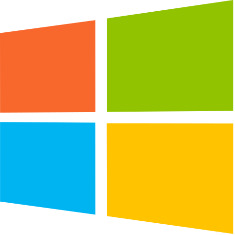

# Building

The repository contains everything required to compile and build the examples on Windows, Linux and Android using a C++ compiler that supports C++11. All required dependencies are included.

##  Windows

[](https://ci.appveyor.com/project/SaschaWillems/vulkan)

Use the provided CMakeLists.txt with [CMake](https://cmake.org) to generate a build configuration for your favorite IDE or compiler, e.g.:
```
cmake -G "Visual Studio 14 2015 Win64"
```

##  Linux

[](https://travis-ci.org/SaschaWillems/Vulkan)

Use the provided CMakeLists.txt with [CMake](https://cmake.org) to generate a build configuration for your favorite IDE or compiler.

##### [Window system integration](https://www.khronos.org/registry/vulkan/specs/1.0-wsi_extensions/html/vkspec.html#wsi)
- **XCB**: Default WSI (if no cmake option is specified)
- **Wayland**: Use cmake option ```USE_WAYLAND_WSI``` (```-DUSE_WAYLAND_WSI=ON```)
- **DirectFB**: Use cmake option ```USE_DIRECTFB_WSI``` (```-DUSE_DIRECTFB_WSI=ON```)
- **DirectToDisplay**: Use cmake option ```USE_D2D_WSI``` (```-DUSE_D2D_WSI=ON```)

##  [Android](android/)

Building on Android is done using the [Gradle Build Tool](https://gradle.org/):

```
cd android
./gradlew assembleDebug
```
This will download gradle locally, build all samples and output the apks to ```android\examples\bin```.

On Windows execute `gradlew.bat assembleDebug`.

If you want to build and install on a connected device or emulator image, run ```gradle installDebug``` instead.

##  [iOS and macOS](xcode/)

Building for *iOS* and *macOS* is done using the [examples](xcode/examples.xcodeproj) *Xcode* project found in the [xcode](xcode) directory. These examples use the [**MoltenVK**](https://moltengl.com/moltenvk) Vulkan driver to provide Vulkan support on *iOS* and *macOS*, and require an *iOS* or *macOS* device that supports *Metal*. Please see the [MoltenVK Examples readme](xcode/README_MoltenVK_Examples.md) for more info on acquiring **MoltenVK** and building and deploying the examples on *iOS* and *macOS*.

##### MacOS
Use the provided CMakeLists.txt with [CMake](https://cmake.org) to generate a build configuration for your favorite IDE or compiler, e.g.:
```
cmake -G "Xcode"
```