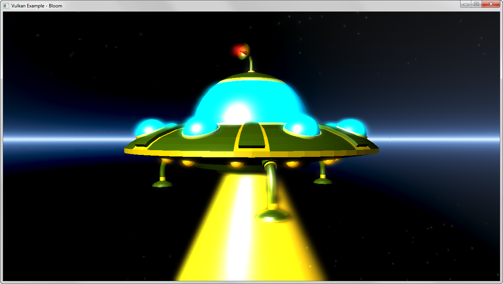

# Vulkan examples and demos

Assorted C++ examples for [Vulkan(tm)](https://www.khronos.org/vulkan/), the new graphics and compute API from Khronos.

# Building

The repository contains everything required to compile and build the examples on Windows, Linux and Android. All required dependencies are included.

##  Windows
A Visual Studio solution file for compiling all examples is included with the repository, examples will compile with VS2015 out of the box.

If you're using a different IDE or compiler you can use the provided CMakeLists.txt for use with [CMake](https://cmake.org) to generate a build configuration for your toolchain.

##  Linux

Use the provided the provided CMakeLists.txt for use with [CMake](https://cmake.org) to generate a build configuration for your favorite IDE or compiler.

Note that you need [assimp](https://github.com/assimp/assimp) in order to compile the examples for Linux. Either compile and install from the repository, or install libassimp-dev. The examples require at least version 3.2.

##  [Android](android/)

Building on Android is done using the [Android NDK](http://developer.android.com/tools/sdk/ndk/index.html) and requires a device that supports Vulkan. Please see the [Android readme](./android/README.md) on how to build and deploy the examples.

## Binaries

Precompiled binaries for Windows (x64), Linux (x64) and Android can be [found here](http://vulkan.gpuinfo.org/examples.php). I'll try keep them up-to-date with the repository.

Note that these only contain the binaries, you still need the repository for the data (shaders, models, textures) and put the binaries into to bin subfolder. Except for Android, where all required assets are stored inside of the apk.

## API-Version

The examples are build against **API Version 1.0.5** and support **implementations starting with 1.0.2**. This ensures that beta drivers not updated to the most recent API-Version can run the examples.

## Additional documentation

Additional documentation for several base classes and functionality (e.g. the swap chain) can be found [in this directory](./documentation/additionaldocs.md).

# Examples

## [Triangle](triangle/)

Most basic example. Renders a colored triangle using an indexed vertex buffer. Vertex and index data are uploaded to device local memory using so-called "staging buffers". Uses a single pipeline with basic shaders loaded from SPIR-V and and single uniform block for passing matrices that is updated on changing the view.

This example is far more explicit than the other examples and is meant to be a starting point for learning Vulkan from the ground up. Much of the code is boilerplate that you'd usually encapsulate in helper functions and classes (which is what the other examples do).
  

## [Texture mapping](texture/)

Loads a single texture and displays it on a simple quad. Shows how to upload a texture including mip maps to the gpu in an optimal (tiling) format. Also demonstrates how to display the texture using a combined image sampler with anisotropic filtering enabled.
  

## [Cubemap](texturecubemap/)

Building on the basic texture loading example a cubemap is loaded into host visible memory and then transformed into an optimal format for the GPU.
The demo uses two different pipelines (and shader sets) to display the cubemap as a skybox (background) and as a source for reflections.
  

## [Texture array](texturearray/)

Texture arrays allow storing of multiple images in different layers without any interpolation between the layers.
This example demonstrates the use of a 2D texture array with instanced rendering. Each instance samples from a different layer of the texture array.
  

## [Distance field fonts](distancefieldfonts/)

Instead of just sampling a bitmap font texture, a texture with per-character signed distance fields is used to generate high quality glyphs in the fragment shader. This results in a much higher quality than common bitmap fonts, even if heavily zoomed.

Distance field font textures can be generated with tools like [Hiero](https://github.com/libgdx/libgdx/wiki/Hiero).
  

## [Pipelines](pipelines/)

Pipelines replace the huge (and cumbersome) state machine of OpenGL. This example creates different pipelines with different states and shader setups.
  

## [Gears](gears/)

Vulkan interpretation of glxgears. Procedurally generates separate meshes for each gear, with every mesh having it's own uniform buffer object for animation. Also demonstrates how to use different descriptor sets.
  

## [Mesh loading and rendering](mesh/)

Uses [assimp](https://github.com/assimp/assimp) to load and a mesh from a common 3D format including a color map. The mesh data is then converted to a fixed vertex layout matching the pipeline (and shader) layout descriptions.
  

## [Mesh instancing](instancing/)

Shows the use of instancing for rendering the same mesh with differing uniforms with one single draw command. This saves performance if the same mesh has to be rendered multiple times.
  

## [Multi sampling](multisampling/)

Demonstrates the use of resolve attachments for doing multisampling. Instead of doing an explicit resolve from a multisampled image this example creates multisampled attachments for the color and depth buffer and sets up the render pass to use these as resolve attachments that will get resolved to the visible frame buffer at the end of this render pass. To highlight MSAA the example renders a mesh with fine details against a bright background. Here is a [screenshot without MSAA](./screenshots/multisampling_nomsaa.png) to compare.
  

## [Particle system](particlefire/)

Point sprite based particle system simulating a fire. Particles and their attributes are stored in a host visible vertex buffer that's updated on the CPU on each frame. Also makes use of pre-multiplied alpha for rendering particles with different blending modes (smoke and fire) in one single pass.

## [Push constants](pushconstants/)

Demonstrates the use of push constants for updating small blocks of shader data with high speed (and without having to use a uniform buffer). Displays several light sources with position updates through a push constant block in a separate command buffer.
  

## [Occlusion queries](occlusionquery/)

Shows how to use occlusion queries to determine object visibility depending on the number of passed samples for a given object. Does an occlusion pass first, drawing all objects (and the occluder) with basic shaders, then reads the query results to conditionally color the objects during the final pass depending on their visibility.
  

## [Offscreen rendering](offscreen/)

Uses a separate framebuffer (that is not part of the swap chain) and a texture target for offscreen rendering. The texture is then used as a mirror.
  

## [Radial blur](radialblur/)

Demonstrates basic usage of fullscreen shader effects. The scene is rendered offscreen first, gets blitted to a texture target and for the final draw this texture is blended on top of the 3D scene with a radial blur shader applied.
  

## [Bloom](bloom/)

Implements a bloom effect to simulate glowing parts of a 3D mesh. A two pass gaussian blur (horizontal and then vertical) is used to generate a blurred low res version of the scene only containing the glowing parts of the 3D mesh. This then gets blended onto the scene to add the blur effect.
  

## [Deferred shading](deferred/)

Demonstrates the use of multiple render targets to fill a G-Buffer for deferred shading.

Deferred shading collects all values (color, normal, position) into different render targets in one pass thanks to multiple render targets, and then does all shading and lighting calculations based on these in screen space, thus allowing for much more light sources than traditional forward renderers.
  

## [Shadowmapping](shadowmapping/)

Shows how to implement directional dynamic shadows with a single shadow map in two passes. Pass one renders the scene from the light's point of view and copies the depth buffer to a depth texture.
The second pass renders the scene from the camera's point of view using the depth texture to compare the depth value of the texels with the one stored in the depth texture to determine whether a texel is shadowed or not and also applies a PCF filter for smooth shadow borders.
To avoid shadow artifacts the dynamic depth bias state ([vkCmdSetDepthBias](https://www.khronos.org/registry/vulkan/specs/1.0/man/html/vkCmdSetDepthBias.html)) is used to apply a constant and slope dept bias factor.

## [Omnidirectional shadow mapping](shadowmappingomni/)

Uses a dynamic 32 bit floating point cube map for a point light source that casts shadows in all directions (unlike projective shadow mapping).
The cube map faces contain the distances from the light sources, which are then used in the scene rendering pass to determine if the fragment is shadowed or not.
  

## [Spherical environment mapping](sphericalenvmapping/)

Uses a (spherical) material capture texture containing environment lighting and reflection information to fake complex lighting. The example also uses a texture array to store (and select) several material caps that can be toggled at runtime.

 The technique is based on [this article](https://github.com/spite/spherical-environment-mapping).
  

## [Parallax mapping](parallaxmapping/)

Like normal mapping, parallax mapping simulates geometry on a flat surface. In addition to normal mapping a heightmap is used to offset texture coordinates depending on the viewing angle giving the illusion of added depth.
  

## [Skeletal animation](skeletalanimation/)

Based on the mesh loading example, this example loads and displays a rigged COLLADA model including animations. Bone weights are extracted for each vertex and are passed to the vertex shader together with the final bone transformation matrices for vertex position calculations.
  

## [(Tessellation shader) PN-Triangles](tessellation/)

Generating curved PN-Triangles on the GPU using tessellation shaders to add details to low-polygon meshes, based on [this paper](http://alex.vlachos.com/graphics/CurvedPNTriangles.pdf), with shaders from [this tutorial](http://onrendering.blogspot.de/2011/12/tessellation-on-gpu-curved-pn-triangles.html).
  

## [(Tessellation shader) Displacement mapping](tessellation/)

Uses tessellation shaders to generate additional details and displace geometry based on a displacement map (heightmap).
  

## [(Compute shader) Particle system](computeshader/)

Attraction based particle system. A shader storage buffer is used to store particle data and updated by a compute shader. The buffer is then used by the graphics pipeline for rendering.
  

## [(Compute shader) Image processing](computeshader/)

Demonstrates the use of a separate compute queue (and command buffer) to apply different convolution kernels on an input image.
  

## [(Geometry shader) Normal debugging](geometryshader/)

Renders the vertex normals of a complex mesh with the use of a geometry shader. The mesh is rendered solid first and the a geometry shader that generates lines from the face normals is used in the second pass.
  

## [Vulkan demo scene](vulkanscene/)

More of a playground than an actual example. Renders multiple meshes with different shaders (and pipelines) including a background.
  

 
## [Android](android/)

This repository also contains a few Android examples that are (for now) separated from the rest of the examples. See the [Android readme](./android/README.md) for details on what is included and how to build the examples.

The examples already share a few source files with existing examples and might be integrated into them at some point.

## Credits
Thanks to the authors of these libraries :
- [OpenGL Mathematics (GLM)](https://github.com/g-truc/glm)
- [OpenGL Image (GLI)](https://github.com/g-truc/gli)
- [Open Asset Import Library](https://github.com/assimp/assimp)
- [Tiny obj loader](https://github.com/syoyo/tinyobjloader)

And a huge thanks to the Vulkan Working Group, Vulkan Advisory Panel, the fine people at LunarG and everyone from the different IHVs that helped me get the examples up and working on their hardware!

## Attributions / Licenses
Please note that (some) models and textures use separate licenses. Please comply to these when redistributing or using them in your own projects :
- Cubemap used in cubemap example by [Emil Persson(aka Humus)](http://www.humus.name/)
- Armored knight model used in deferred example by [Gabriel Piacenti](http://opengameart.org/users/piacenti)
- Voyager model by [NASA](http://nasa3d.arc.nasa.gov/models)
- Astroboy COLLADA model copyright 2008 Sony Computer Entertainment Inc.
- Bear mug model used in tessellation example by [Aare](http://opengameart.org/users/aare)
- Textures used in some examples by [Hugues Muller](http://www.yughues-folio.com)
- Vulkan scene model (and derived models) by [Dominic Agoro-Ombaka](http://www.agorodesign.com/) and [Sascha Willems](http://www.saschawillems.de)
- Vulkan and the Vulkan logo are trademarks of the [Khronos Group Inc.](http://www.khronos.org)

## External resources
- [LunarG Vulkan SDK](https://vulkan.lunarg.com)
- [Official list of Vulkan resources](https://www.khronos.org/vulkan/resources)
- [Vulkan API specifications](https://www.khronos.org/registry/vulkan/specs/1.0/apispec.html) ([quick reference cards](https://www.khronos.org/registry/vulkan/specs/1.0/refguide/Vulkan-1.0-web.pdf))
- [SPIR-V specifications](https://www.khronos.org/registry/spir-v/specs/1.0/SPIRV.html)
- [My personal view on Vulkan (as a hobby developer)](http://www.saschawillems.de/?p=1886)
