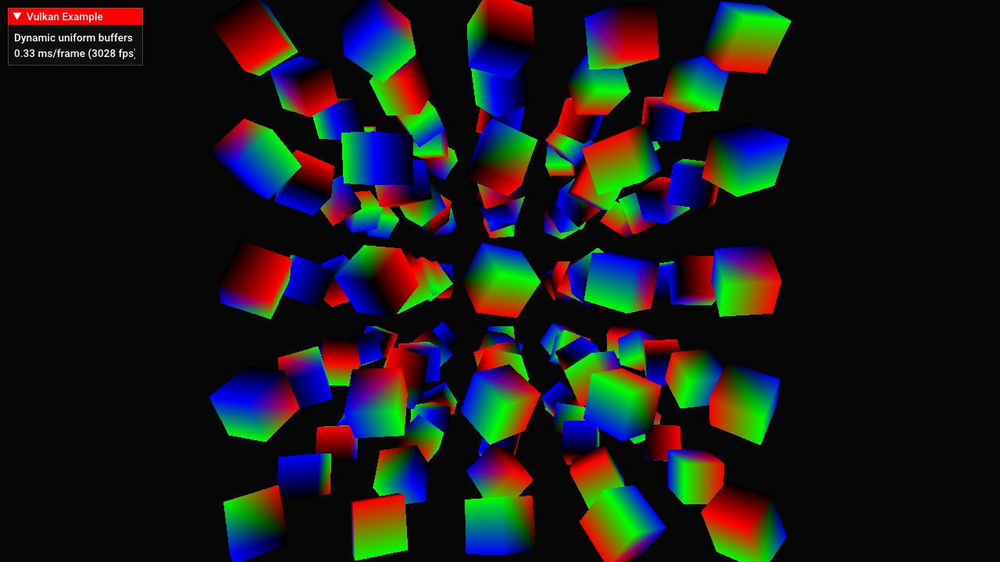
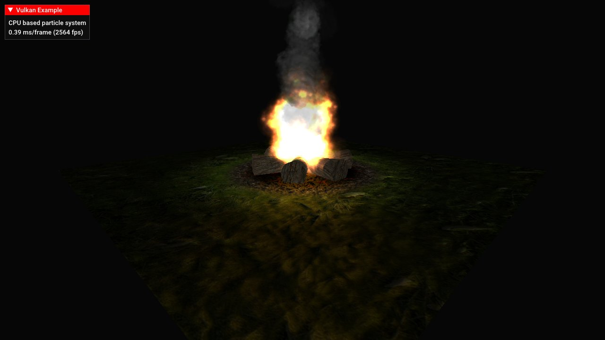
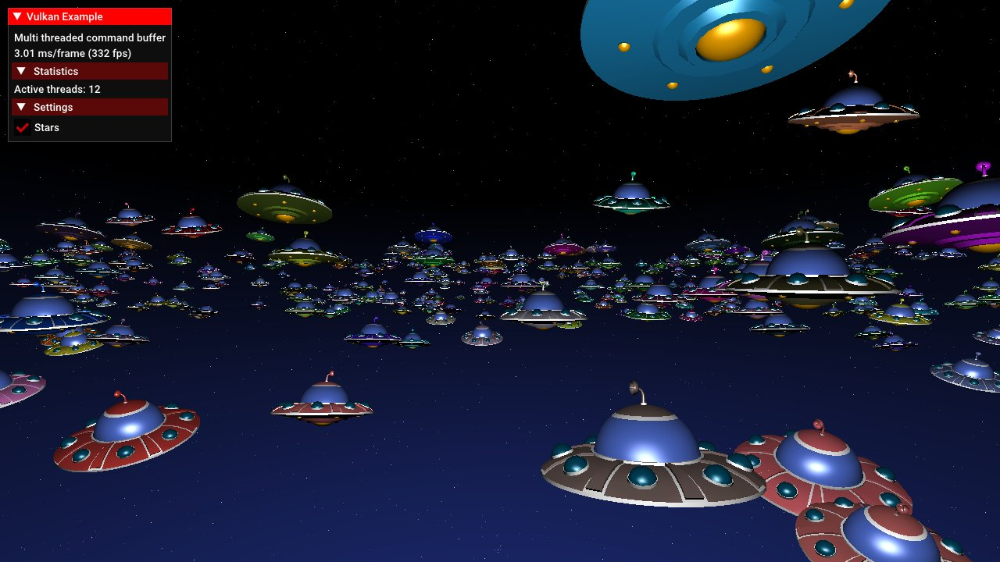

# Vulkan examples and demos


Assorted C++ examples for [Vulkan(tm)](https://www.khronos.org/vulkan/), the new graphics and compute API from Khronos.

# Building

The repository contains everything required to compile and build the examples on Windows, Linux and Android using a C++ compiler that supports C++11. All required dependencies are included.

##  Windows

[](https://ci.appveyor.com/project/SaschaWillems/vulkan)

A Visual Studio solution file for compiling all examples is included with the repository, examples will compile with VS2015 out of the box.

If you're using a different IDE or compiler you can use the provided CMakeLists.txt for use with [CMake](https://cmake.org) to generate a build configuration for your toolchain.

##  Linux

[](https://travis-ci.org/SaschaWillems/Vulkan)

Use the provided CMakeLists.txt with [CMake](https://cmake.org) to generate a build configuration for your favorite IDE or compiler.

Note that you need [assimp](https://github.com/assimp/assimp) in order to compile the examples for Linux. Either compile and install from the repository, or install libassimp-dev. The examples require at least version 3.2.

##### [Window system integration](https://www.khronos.org/registry/vulkan/specs/1.0-wsi_extensions/html/vkspec.html#wsi)
- **XCB**: Default WSI (if no cmake option is specified)
- **Wayland**: Use cmake option ```USE_WAYLAND_WSI``` (```-DUSE_WAYLAND_WSI=ON```)
- **DirectToDisplay**: Use cmake option ```USE_D2D_WSI``` (```-DUSE_D2D_WSI=ON```)

##  [Android](android/)

Building on Android is done using the [Android NDK](http://developer.android.com/tools/sdk/ndk/index.html) and requires a device that supports Vulkan. Please see the [Android readme](./android/README.md) on how to build and deploy the examples.

## Precompiled binaries

Precompiled binaries for Windows (x64), Linux (x64) and Android can be [found here](http://vulkan.gpuinfo.org/examples.php). Note that these may not always be up-to-date with the repository.

# Examples

*Examples marked with :speech_balloon: offer additional details with a separate readme.*

## Basics

### [Triangle](triangle/)


Most basic example. Renders a colored triangle using an indexed vertex buffer. Vertex and index data are uploaded to device local memory using so-called "staging buffers". Uses a single pipeline with basic shaders loaded from SPIR-V and and single uniform block for passing matrices that is updated on changing the view.

This example is far more explicit than the other examples and is meant to be a starting point for learning Vulkan from the ground up. Much of the code is boilerplate that you'd usually encapsulate in helper functions and classes (which is what the other examples do).

### [Pipelines](pipelines/)


[Pipeline state objects](https://www.khronos.org/registry/vulkan/specs/1.0/xhtml/vkspec.html#pipelines) replace the biggest part of the dynamic state machine from OpenGL, baking state information for culling, blending, rasterization, etc. and shaders into a fixed stat that can be optimized much easier by the implementation.

This example uses three different PSOs for rendering the same scene with different visuals and shaders and also demonstrates the use of [pipeline derivatives](https://www.khronos.org/registry/vulkan/specs/1.0/xhtml/vkspec.html#pipelines-pipeline-derivatives).

### [Texture mapping](texture/)


Shows how to upload a 2D texture into video memory for sampling in a shader. Loads a compressed texture into a host visible staging buffer and copies all mip levels to a device local optimal tiled image for best performance.

Also demonstrates the use of combined image samplers. Samplers are detached from the actual texture image and only contain information on how an image is sampled in the shader.

### [Cube maps](texturecubemap/)


Building on the basic texture loading example, a cubemap texture is loaded into a staging buffer and is copied over to a device local optimal image using buffer to image copies for all of it's faces and mip maps.

The demo then uses two different pipelines (and shader sets) to display the cubemap as a skybox (background) and as a source for reflections.

### [Texture arrays](texturearray/)


Texture arrays allow storing of multiple images in different layers without any interpolation between the layers.
This example demonstrates the use of a 2D texture array with instanced rendering. Each instance samples from a different layer of the texture array.

### [Mesh rendering](mesh/)


Uses [assimp](https://github.com/assimp/assimp) to load a mesh from a common 3D format including a color map. The mesh data is then converted to a fixed vertex layout matching the shader vertex attribute bindings.

### [Dynamic uniform buffers](dynamicuniformbuffer/) :speech_balloon:


Demonstrates the use of dynamic uniform buffers for rendering multiple objects with different matrices from one big uniform buffer object. Sets up one bug uniform buffer that contains multiple model matrices that are dynamically addressed upon decriptor binding time.

This minimizes the number of descriptor sets required and may help in optimizing memory writes by e.g. only doing partial updates to that memory.

### [Push constants](pushconstants/)


Demonstrates the use of push constants for updating small blocks of shader data at pipeline creation time, without having to use a uniform buffer. Displays several light sources with position updates through a push constant block in a separate command buffer.

### [Specialization constants](specializationconstants/)


Demonstrates the use of SPIR-V specialization constants used to specify shader constants at pipeline creation time. The example uses one "uber" shader with different lighting paths (phong, toon, texture mapped) from which all pipelines are build, with a specialization constant used to select the shader path to be used for that pipeline at creation time.

### [Offscreen rendering](offscreen/)


Shows how to do basic offscreen rendering. Uses a separate framebuffer with color and depth attachments (that is not part of the swap chain) to render the mirrored scene off screen in the first pass.

The second pass then samples from the color attachment of that framebuffer for rendering a mirror surface.

### [Fullscreen radial blur](radialblur/)


Demonstrates the basics of a fullscreen (fragment) shader effect. The scene is rendered into a low resolution offscreen framebuffer first and blended on top of the scene in a second pass. The fragment shader also applies a radial blur to it.

### [Text rendering](textoverlay/)


Renders a 2D text overlay on top of an existing 3D scene. The example implements a text overlay class with separate descriptor sets, layouts, pipelines and render pass to detach it from the rendering of the scene. The font is generated by loading glyph data from a [stb font file](http://nothings.org/stb/font/) into a buffer that's copied to the font image.

After rendering the scene, the second render pass of the text overlay class loads the contents of the first render pass and displays text on top of it using blending.

### [CPU particles](particlefire/)


CPU based point sprite particle system simulating a fire. Particles and their attributes are stored in a host visible vertex buffer that's updated on the CPU on each frame. Demonstrates how to update vertex buffer per frame.

Also makes use of pre-multiplied alpha for rendering particles with different blending modes (smoke and fire) in one single pass.

## Advanced

### [Multi threaded command buffer generation](multithreading/)

This example demonstrates multi threaded command buffer generation. All available hardware threads are used to generated n secondary command buffers concurrent, with each thread also checking object visibility against the current viewing frustum. Command buffers are rebuilt on each frame.

Once all threads have finished (and all secondary command buffers have been constructed), the secondary command buffers are executed inside the primary command buffer and submitted to the queue.

### [Scene rendering](scenerendering/)


This example demonstrates a way to render a complex scene consisting of multiple meshes with different materials and textures. It makes use of separate per-material descriptor sets for passing texturing information and uses push constants to pass material properties to the shaders upon pipeline creation.

Also shows how to use multiple descriptor sets simultaneously with the new GLSL "set" layout qualifier introduced with [GL_KHR_vulkan_glsl](https://www.khronos.org/registry/vulkan/specs/misc/GL_KHR_vulkan_glsl.txt).

### [Instancing](instancing/)


Uses instancing for rendering multiple instances of the same mesh using different attributes. A secondary vertex buffer containing instanced data (in device local memory) is used to pass instanced data to the shader via vertex attributes, including a texture layer index for using different textures per-instance. Also shows how to mix instanced and non-instanced object rendering.
<br><br>

### [Indirect drawing](indirectdraw/) :speech_balloon:


This example renders thousands of instanced objects with different geometries using only one single indirect draw call (if ```multiDrawIndirect``` is supported). Unlike direct drawing function, indirect drawing functions take their draw commands from a buffer object containing information like index cound, index offset and number of instances to draw.

Shows how to generate and render such an indirect draw command buffer that is staged to the device. Indirect draw buffers are the base for generating and updating draw commands on the GPU using shaders.

### [High dynamic range](hdr/)


Demonstrates high dynamic range rendering using floating point texture and framebuffer formats, extending the internal image precision range from the usual 8 Bits used in LDR to 16/32 bits. Also adds HDR bloom on top of the scene using a separable blur filter and manual exposure via tone mapping.

### [Occlusion queries](occlusionquery/)


Shows how to use occlusion queries to determine object visibility depending on the number of passed samples for a given object. Does an occlusion pass first, drawing all objects (and the occluder) with basic shaders, then reads the query results to conditionally color the objects during the final pass depending on their visibility.

### [Run-time mip-map generation](texturemipmapgen/) :speech_balloon:


Generates a complete mip-chain at runtime (instead of using mip levels stored in texture file) by blitting from one mip level down to the next smaller size until the lower end of the mip chain (1x1 pixels is reached).

This is done using image blits and proper image memory barriers.     

### [Multi sampling](multisampling/)


Demonstrates the use of resolve attachments for doing multisampling. Instead of doing an explicit resolve from a multisampled image this example creates multisampled attachments for the color and depth buffer and sets up the render pass to use these as resolve attachments that will get resolved to the visible frame buffer at the end of this render pass. To highlight MSAA the example renders a mesh with fine details against a bright background. Here is a [screenshot without MSAA](./screenshots/multisampling_nomsaa.png) to compare.

### [Shadow mapping](shadowmapping/)


Dynamic shadows from a ```directional light source``` in two passes. The first pass renders the scene depth from the light's point-of-view into a separate framebuffer attachment with a different (higher) resolution.

The second pass renders the scene from the camera's point-of-view and compares the depth value of the texels with the one stored in the offscreen depth attachment (which the shader directly samples from) to determine whether a texel is shadowed or not and then applies a PCF filter to smooth out shadow borders. To avoid shadow artifacts the dynamic depth bias state ([vkCmdSetDepthBias](https://www.khronos.org/registry/vulkan/specs/1.0/man/html/vkCmdSetDepthBias.html)) is used to apply a constant and slope dept bias factor.

### [Omnidirectional shadow mapping](shadowmappingomni/)


Dynamic shadows from a ```point light source```. Uses a dynamic 32 bit floating point cube map for a point light source that casts shadows in all directions (unlike projective shadow mapping).

The cube map faces contain the distances from the light sources, which are then used in the final scene rendering pass to determine if the fragment is shadowed or not.

### [Skeletal animation](skeletalanimation/)


This example loads and displays a rigged COLLADA model including animations. Bone weights are extracted for each vertex and are passed to the vertex shader together with the final bone transformation matrices for vertex position calculations.

### [Bloom](bloom/)


Advanced fullscreen shader example implementing a separated gaussian blur using two passes. The glowing parts of the scene are rendered to a low-resoluation offscreen framebuffer that is blurred in two steps and then blended on top of the scene.

## Deferred

*These examples use a [deferred shading](https://en.wikipedia.org/wiki/Deferred_shading) setup*

### [Deferred shading](deferred/)


Demonstrates the use of multiple render targets to fill a G-Buffer for a deferred shading setup with multiple dynamic lights and normal mapped surfaces.

Deferred shading collects all values (color, normal, position) into different render targets in one pass thanks to multiple render targets, and then does all shading and lighting calculations based on these in screen space, thus allowing for much more light sources than traditional forward renderers.

### [Deferred shading and shadow mapping](deferredshadows/)


Building on the deferred shading setup this example adds directional shadows using shadow maps from multiple spotlights.

Scene depth from the different light's point-of-view is renderer to a layered depth attachment using only one pass. This is done using multiple geometry shader invocations that allows to output multiple instances of the same geoemtry using different matrices into the layers of the depth attachment.

The final scene compositing pass then samples from the layered depth map to determine if a fragment is shadowed or not.

### [Screen space ambient occlusion](ssao/)


Implements ambient occlusion in screen space, adding depth with the help of ambient occlusion to a scene. The example is using a deferred shading setup with the AO pass using the depth information from the deferred G-Buffer to generate the ambient occlusion values. A second pass is then applied to blur the AO results before they're applied to the scene in the final composition pass.

## Compute

*Compute shaders are mandatory in Vulkan and must be supported on all devices*

### [Particle system](computeparticles/)


Attraction based particle system. A shader storage buffer is used to store particle on which the compute shader does some physics calculations. The buffer is then used by the graphics pipeline for rendering with a gradient texture for. Demonstrates the use of memory barriers for synchronizing vertex buffer access between a compute and graphics pipeline

### [N-body simulation](computenbody/)


Implements a N-body simulation based particle system with multiple attractors and particle-to-particle interaction using two passes separating particle movement calculation and final integration.

Also shows how to use ```shared compute shader memory``` for a significant performance boost.

### [Ray tracing](raytracing/)


Implements a simple ray tracer using a compute shader. No primitives are rendered by the traditional pipeline except for a fullscreen quad that displays the ray traced results of the scene rendered by the compute shaders. Also implements shadows and basic reflections.

### [Cull and LOD](computecullandlod/)


Based on ```indirect drawing``` this example uses a compute shader for visibility testing using ```frustum culling``` and ```level-of-detail selection``` based on object's distance to the viewer.

A compute shader is applied to the indirect draw commands buffer that updates the indirect draw calls depending on object visibility and camera distance. This moves all visibility calculations to the GPU so the indirect draw buffer can stay in device local memory without having to map it back to the host for CPU-based updates.

### [Image processing](computeshader/)


Demonstrates the basic use of a separate compute queue (and command buffer) to apply different convolution kernels on an input image in realtime.

## Tessellation

*Tessellation shader support is optional* (see ```deviceFeatures.tessellationShader```)

### [Displacement mapping](tessellation/)


Uses tessellation shaders to generate additional details and displace geometry based on a heightmap.

### [Dynamic terrain tessellation](terraintessellation/)


Renders a terrain with dynamic tessellation based on screen space triangle size, resulting in closer parts of the terrain getting more details than distant parts. The terrain geometry is also generated by the tessellation shader using a 16 bit height map for displacement. To improve performance the example also does frustum culling in the tessellation shader.

### [PN-Triangles](tessellation/)


Generating curved PN-Triangles on the GPU using tessellation shaders to add details to low-polygon meshes, based on [this paper](http://alex.vlachos.com/graphics/CurvedPNTriangles.pdf), with shaders from [this tutorial](http://onrendering.blogspot.de/2011/12/tessellation-on-gpu-curved-pn-triangles.html).

## Geometry shader

*Geometry shader support is optional* (see ```deviceFeatures.geometryShader```)

### [Normal debugging](geometryshader/)


Uses a geometry shader to generate per-vertex normals that could be used for debugging. The first pass displays the solid mesh using basic phong shading and then does a second pass with the geometry shader that generates normals for each vertex of the mesh.

## Extensions

### [VK_EXT_debug_marker](debugmarker/)


Example application to be used along with [this tutorial](http://www.saschawillems.de/?page_id=2017) for demonstrating the use of the new VK_EXT_debug_marker extension. Introduced with Vulkan 1.0.12, it adds functionality to set debug markers, regions and name objects for advanced debugging in an offline graphics debugger like [RenderDoc](http://www.renderdoc.org).

## Misc

### [Vulkan Gears](gears/)


Vulkan interpretation of glxgears. Procedurally generates separate meshes for each gear, with every mesh having it's own uniform buffer object for animation. Also demonstrates how to use different descriptor sets.

### [Distance field fonts](distancefieldfonts/)


Instead of just sampling a bitmap font texture, a texture with per-character signed distance fields is used to generate high quality glyphs in the fragment shader. This results in a much higher quality than common bitmap fonts, even if heavily zoomed.

Distance field font textures can be generated with tools like [Hiero](https://github.com/libgdx/libgdx/wiki/Hiero).

### [Spherical environment mapping](sphericalenvmapping/)


Uses a (spherical) material capture texture containing environment lighting and reflection information to fake complex lighting. The example also uses a texture array to store (and select) several material caps that can be toggled at runtime.

The technique is based on [this article](https://github.com/spite/spherical-environment-mapping).

### [Parallax mapping](parallaxmapping/)


Like normal mapping, parallax mapping simulates geometry on a flat surface. In addition to normal mapping a heightmap is used to offset texture coordinates depending on the viewing angle giving the illusion of added depth.

### [Vulkan demo scene](vulkanscene/)


More of a playground than an actual example. Renders the Vulkan logo using multiple meshes with different shaders (and pipelines) including a background.

## Credits
Thanks to the authors of these libraries :
- [OpenGL Mathematics (GLM)](https://github.com/g-truc/glm)
- [OpenGL Image (GLI)](https://github.com/g-truc/gli)
- [Open Asset Import Library](https://github.com/assimp/assimp)
- [Tiny obj loader](https://github.com/syoyo/tinyobjloader)

And a huge thanks to the Vulkan Working Group, Vulkan Advisory Panel, the fine people at [LunarG](http://www.lunarg.com), Baldur Karlsson ([RenderDoc](https://github.com/baldurk/renderdoc)) and everyone from the different IHVs that helped me get the examples up and working on their hardware!

## Attributions / Licenses
Please note that (some) models and textures use separate licenses. Please comply to these when redistributing or using them in your own projects :
- Cubemap used in cubemap example by [Emil Persson(aka Humus)](http://www.humus.name/)
- Armored knight model used in deferred example by [Gabriel Piacenti](http://opengameart.org/users/piacenti)
- Voyager model by [NASA](http://nasa3d.arc.nasa.gov/models)
- Old deer model used in tessellation example by [Čestmír Dammer](http://opengameart.org/users/cdmir)
- Hidden treasure scene used in pipeline and debug marker examples by [Laurynas Jurgila](http://www.blendswap.com/user/PigArt)
- Sibenik Cathedral model by Marko Dabrovic, using updated version by [Kenzie Lamar and Morgan McGuire](http://graphics.cs.williams.edu/data/meshes.xml)
- Textures used in some examples by [Hugues Muller](http://www.yughues-folio.com)
- Updated compute particle system shader by [Lukas Bergdoll](https://github.com/Voultapher)
- Vulkan scene model (and derived models) by [Dominic Agoro-Ombaka](http://www.agorodesign.com/) and [Sascha Willems](http://www.saschawillems.de)
- Vulkan and the Vulkan logo are trademarks of the [Khronos Group Inc.](http://www.khronos.org)

## External resources
- [LunarG Vulkan SDK](https://vulkan.lunarg.com)
- [Official list of Vulkan resources](https://www.khronos.org/vulkan/resources)
- [Vulkan API specifications](https://www.khronos.org/registry/vulkan/specs/1.0/apispec.html) ([quick reference cards](https://www.khronos.org/registry/vulkan/specs/1.0/refguide/Vulkan-1.0-web.pdf))
- [SPIR-V specifications](https://www.khronos.org/registry/spir-v/specs/1.0/SPIRV.html)
- [My personal view on Vulkan (as a hobby developer)](http://www.saschawillems.de/?p=1886)
