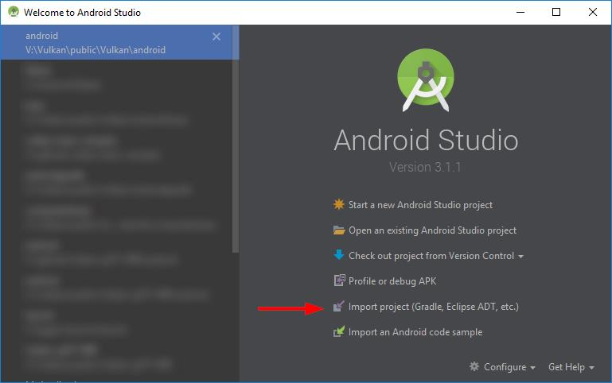
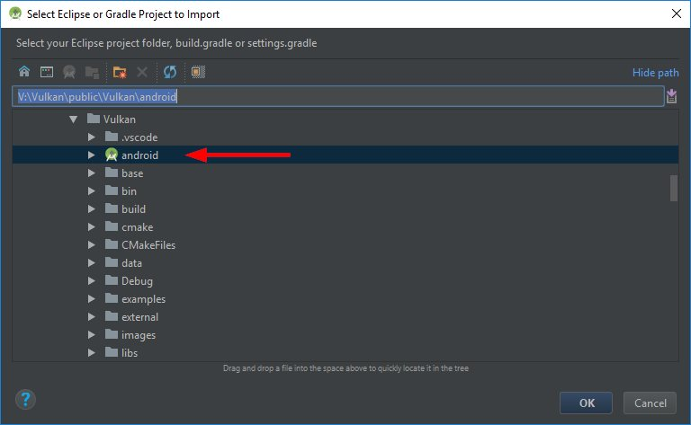

#  Vulkan examples on Android

## Device support
- **To run these examples you need a device with an Android image that suports Vulkan**
- Builds currently only support arm-v7, other architectures may be added later
- Basic gamepad support is available too (zoom and rotate)
- Basic touch control support (zoom, move, rotate, look)

## Building

### Requirements

- [Android Studio](https://developer.android.com/studio/)
- [Android NDK](https://developer.android.com/ndk/downloads/) (r11b or higher)
- [Android SDK](https://developer.android.com/studio/index.html)

### Update the asset pack

During the Android build process, assets are copied over from the data folder, so it's important to make sure that a current version of the [asset pack](../data/README.md) has been downloaded and extracted. 

### Building the Examples

Select **Import project** from the welcome screen (or from inside Android via **File->New**):

Navigate to the **android** subfolder of this repository (should be higlighted with a gadle symbol):

Select OK to start the import.

**Note:** Initial import will take a while due to the number of examples.

Once the import is done, the samples can be build, debugged and run from inside Android Studio just like any other Android project.

**Note:** If you update the repository at a later point you may have to resync to have additional examples added to the Android Studio project (**File->Sync Project with Gradle files**).
