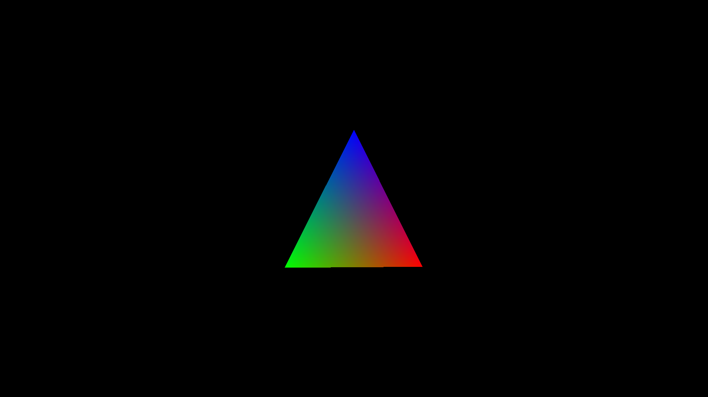
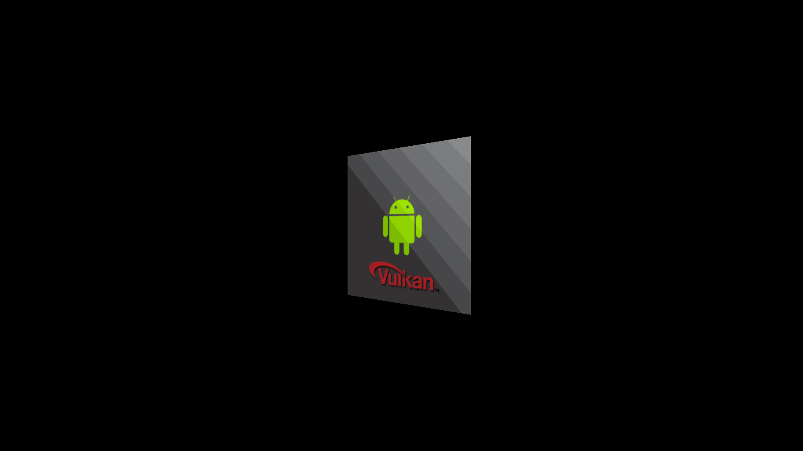
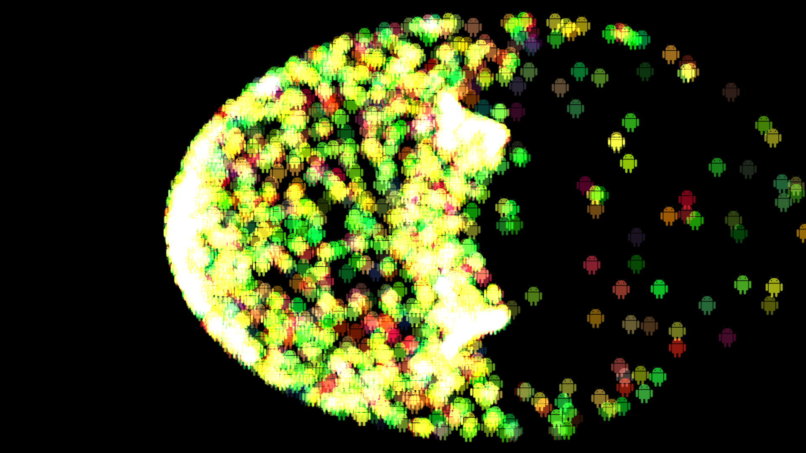

# Vulkan examples and demos - Android

## Building

The examples have been built using Visual Studio 2015 and require the Android NDK for building.

## Vulkan on Android

Since Vulkan is not yet part of the Android OS (like OpenGL ES) the library and function pointers need to be dynamically loaded before using any of the Vulkan functions. See the **vulkanandroid.h** and **vulkanandroid.cpp** files in the base folder of the repositoy root for how this is done.

**To run these examples you need a device with an Android image that suports Vulkan and has the libvulkan.so preinstalled!**

## Examples

## Triangle

Demonstrates a basic Vulkan setup for Android for rendering a triangle. A real life application would encapulate most of the Vulkan object creation stuff (which is done in subsequent examples), so this is more of an example to study how Vulkan works. Also sets up a swap chain for presenting the rendered images to the windowing system.

  

## Texture mapping

Loads a mipmapped texture from the asset manager and it on a simple quad. Shows how to upload a texture including mip maps to the gpu in an optimal (tiling) format. Also demonstrates how to display the texture using a combined image sampler with anisotropic filtering enabled.
  

## Mesh loading and rendering

Uses [syoyos' tinyobj loader](https://github.com/syoyo/tinyobjloader) to load and render a mesh from the asset manager. The mesh data is then converted to a fixed vertex layout matching the pipeline (and shader) layout descriptions.
  

## Compute shader Particle system

Attraction based particle system. A shader storage buffer is used to store particle data and updated by a compute shader. The buffer is then used by the graphics pipeline for rendering.
