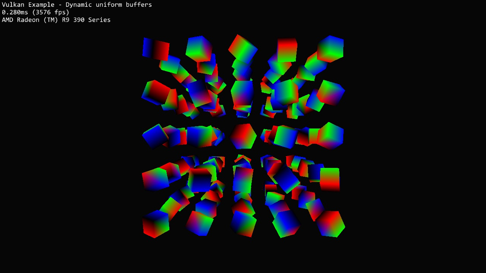

# Dynamic uniform buffers



## Synopsis

Use a single uniform buffer object as a dynamic uniform buffer to draw multiple objects with different matrices from one big uniform buffer object.

## Requirements

The max. number of dynamic uniform buffers supported by the device should be checked with the [maxDescriptorSetUniformBuffersDynamic](http://vulkan.gpuinfo.org/listreports.php?limit=maxDescriptorSetUniformBuffersDynamic) device limit if you need more than the 8 dynamic uniform buffers required by the Vulkan specification.

## Description

This example demonstrates the use of dynamic uniform buffers (```VK_DESCRIPTOR_TYPE_UNIFORM_BUFFER_DYNAMIC```) for offsetting into one or more uniform block objects when binding the descriptor set using [vkCmdBindDescriptorSets](https://www.khronos.org/registry/vulkan/specs/1.0/man/html/vkCmdBindDescriptorSets.html]).

Instead of having single uniform buffers for each descriptor, dynamic uniform buffers can be used to store data for multiple descriptors in one single uniform buffer.

This minimizes the number of descriptor sets required and may help in optimizing memory writes by e.g. only doing partial updates to that memory.

For this example we will store the model matrices for multiple objects in one dynamic uniform buffer object and offset into this for each object draw.

## Points of interest

### Shader binding

The shader binding itself does not have to be changed compared to a static (single) uniform buffer, as the offset is done in the actual application code.

```glsl
layout (binding = 1) uniform UboInstance {
	mat4 model; 
} uboInstance;
```

### Preparing the uniform buffer (and memory)

***Note:*** When preparing the (host) memory to back up the dynamic uniform buffer object it's crucial to take the [minUniformBufferOffsetAlignment](http://vulkan.gpuinfo.org/listreports.php?limit=minUniformBufferOffsetAlignment) limit of the implementation into account. 

Due to the implementation dependent alignment (different from our actual data size) we can't just use a vector and work with pointers instead:

```cpp
struct UboDataDynamic {
  glm::mat4 *model = nullptr;
} uboDataDynamic;
```
First step is to calculate the alignment required for the data we want to store compared to the min. uniform buffer offset alignment reported by the GPU:

```cpp
void prepareUniformBuffers()
{
	// Calculate required alignment based on minimum device offset alignment
	size_t minUboAlignment = vulkanDevice->properties.limits.minUniformBufferOffsetAlignment;
	dynamicAlignment = sizeof(glm::mat4);
	if (minUboAlignment > 0) {
		dynamicAlignment = (dynamicAlignment + minUboAlignment - 1) & ~(minUboAlignment - 1);
	}
```

The max. allowed alignment (as per spec) is 256 bytes which may be much higher than the data size we actually need for each entry (one 4x4 matrix = 64 bytes). 

Now that we know the actual alignment required we can create our host memory for the dynamic uniform buffer:

```cpp
  size_t bufferSize = OBJECT_INSTANCES * dynamicAlignment;
  uboDataDynamic.model = (glm::mat4*)alignedAlloc(bufferSize, dynamicAlignment);
```
*(The ```alignedAlloc``` function is a small wrapper doing aligned memory allocation depending on the OS/Compiler)*

Creating the buffer is the same as creating any other uniform buffer object:

```cpp
vulkanDevice->createBuffer(
  VK_BUFFER_USAGE_UNIFORM_BUFFER_BIT, VK_MEMORY_PROPERTY_HOST_VISIBLE_BIT, &uniformBuffers.dynamic, bufferSize);
```      

*(Updates will be flushed manually, the ```VK_MEMORY_PROPERTY_HOST_COHERENT_BIT``` flag will isn't used)*

### Setting up the descriptors

This is the same as for regular uniform buffers but with descriptor type ```VK_DESCRIPTOR_TYPE_UNIFORM_BUFFER_DYNAMIC``` instead.

#### Descriptor pool

The example uses one dynamic uniform buffer, so we need to request at least one such descriptor type from the descriptor pool:

```cpp
void setupDescriptorPool()
{
  ...
  std::vector<VkDescriptorPoolSize> poolSizes = {
    ...
    vkTools::initializers::descriptorPoolSize(VK_DESCRIPTOR_TYPE_UNIFORM_BUFFER_DYNAMIC, 1),
    ...
  };
```

#### Descriptor set layout

The vertex shader interface defines the uniform with the model matrices (sampled from the dynamic buffer) at binding 1, so we need to setup a matching descriptor set layout:

```cpp
void setupDescriptorSetLayout()
{
  std::vector<VkDescriptorSetLayoutBinding> setLayoutBindings =  {
    ...
    vkTools::initializers::descriptorSetLayoutBinding(VK_DESCRIPTOR_TYPE_UNIFORM_BUFFER_DYNAMIC, VK_SHADER_STAGE_VERTEX_BIT, 1),
    ...
  };
```

#### Descriptor set

The example uses the same descriptor set based on the set layout above for all objects in the scene. As with the layout we bind the dynamic uniform buffer to binding point 1 using the descriptor set up while creating the buffer earlier on.

```cpp
void setupDescriptorSet()
{
  std::vector<VkWriteDescriptorSet> writeDescriptorSets = {    
    // Binding 1 : Instance matrix as dynamic uniform buffer
    vkTools::initializers::writeDescriptorSet(descriptorSet, VK_DESCRIPTOR_TYPE_UNIFORM_BUFFER_DYNAMIC, 1, &uniformBuffers.dynamic.descriptor),
  };
```

### Using the dynamic uniform buffer

Now that everything is set up, it's time to render the objects using the different matrices stored in the dynamic uniform buffer.

```cpp
for (uint32_t j = 0; j < OBJECT_INSTANCES; j++)
{
  // One dynamic offset per dynamic descriptor to offset into the ubo containing all model matrices
  uint32_t dynamicOffset = j * static_cast<uint32_t>(dynamicAlignment);
  // Bind the descriptor set for rendering a mesh using the dynamic offset
  vkCmdBindDescriptorSets(drawCmdBuffers[i], VK_PIPELINE_BIND_POINT_GRAPHICS, pipelineLayout, 0, 1, &descriptorSet, 1, &dynamicOffset);

  vkCmdDrawIndexed(drawCmdBuffers[i], indexCount, 1, 0, 0, 0);
}
```      
For each object to be drawn the offset into the dynamic uniform buffer object's memory is calculated using the dynamic alignment set before buffer creation.

The dynamic offset is then passed at descriptor set binding time using the ```dynamicOffsetCount``` and ```pDynamicOffsets``` parameters of ```vkCmdBindDescriptorSets```.

For each dynamic uniform buffer in the descriptor set currently bound one pointer to an ```uint32_t``` has to be passed in the order of the dynamic buffers' binding indices.

The data starting at the given offset is then passed to the shader for which the dynamic binding applies upon drawing with ```vkCmdDrawIndexed```.

### Updating the buffer

While creating the buffer we did not specify the ```VK_MEMORY_PROPERTY_HOST_COHERENT_BIT``` flag. While this is possible, in a real-world application you would usually only update the parts of the dynamic buffer that actually changed (e.g. only objects that moved since the last frame) and do a manual flush of the updated buffer memory part for better performance. 

This would be done using e.g. [vkFlushMappedMemoryRanges](https://www.khronos.org/registry/vulkan/specs/1.0/man/html/vkFlushMappedMemoryRanges.html).

```cpp
VkMappedMemoryRange memoryRange = vkTools::initializers::mappedMemoryRange();
memoryRange.memory = uniformBuffers.dynamic.memory;
memoryRange.size = sizeof(uboDataDynamic);
vkFlushMappedMemoryRanges(device, 1, &memoryRange);
```
*(The example always updates the whole dynamic buffer's range)*

