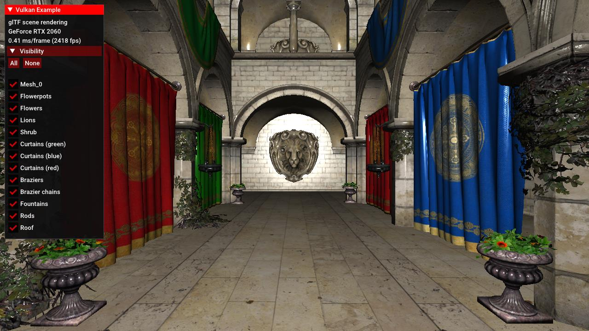

# glTF scene rendering



## Synopsis

Render a complete scene loaded from an glTF file. The sample is based on the [glTF scene](../gltfscene) sample, and adds data structures, functions and shaders required to render a more complex scene using Crytek's Sponza model.

## Description

This example demonstrates how to render a more complex scene loaded from a glTF model.

It builds on the basic glTF scene sample but instead of using global pipelines, it adds per-material pipelines that are dynamically created from the material definitions of the glTF model.

Those pipelines pass per-material parameters to the shader so different materials for e.g. displaying opaque and transparent objects can be built from a single shader.

It also adds data structures, loading functions and shaders to do normal mapping and an easy way of toggling visibility for the scene nodes.

Note that this is not a full glTF implementation as this would be beyond the scope of a simple example. For a complete glTF Vulkan implementation see [my Vulkan glTF PBR renderer](https://github.com/SaschaWillems/Vulkan-glTF-PBR/).

For details on glTF refer to the [official glTF 2.0 specification](https://github.com/KhronosGroup/glTF/tree/master/specification/2.0).

## Points of interest

**Note:** Points of interest are marked with a **POI** in the code comments:

```cpp
// POI: This sample uses normal mapping, so we also need to load the tangents from the glTF file
```

For this sample, those points of interest mark additions and changes compared to the basic glTF sample.

### Loading external images

Unlike the other samples, the glTF scene used for this example doesn't embed the images but uses external ktx images instead. This makes loading a lot faster as the ktx image format natively maps to the GPU and no longer requires us to convert RGB to RGBA, but ktx also allows us to store the mip-chain in the image file itself.

So instead of creating the textures from a buffer that has been converted from the embedded RGB images, we just load the ktx files from disk:

```cpp
void VulkanglTFScene::loadImages(tinygltf::Model& input)
{
	images.resize(input.images.size());
	for (size_t i = 0; i < input.images.size(); i++) {
		tinygltf::Image& glTFImage = input.images[i];
		images[i].texture.loadFromFile(path + "/" + glTFImage.uri, VK_FORMAT_R8G8B8A8_UNORM, vulkanDevice, copyQueue);
	}
}
```

### Materials 

#### New Material properties

```cpp
struct Material 
{
	glm::vec4 baseColorFactor = glm::vec4(1.0f);
	uint32_t baseColorTextureIndex;
	uint32_t normalTextureIndex;
	std::string alphaMode = "OPAQUE";
	float alphaCutOff;
	bool doubleSided = false;
	VkDescriptorSet descriptorSet;
	VkPipeline pipeline;
};
```

Several new properties have been added to the material class for this example that are taken from the glTF source.

Along with the base color we now also get the index of the normal map for that material in ```normalTextureIndex```, and store several material properties required to render the different materials in this scene:

- ```alphaMode```<br/>
The alpha mode defines how the alpha value for this material is determined. For opaque materials it's ignored, for masked materials the shader will discard fragments based on the alpha cutoff.
- ```alphaCutOff```<br/>
For masked materials, this value specifies the threshold between fully opaque and fully transparent. This is used to discard fragments in the fragment shader.
- ```doubleSided```<br/>
This property is used to select the appropriate culling mode for this material. For double-sided materials, culling will be disabled.

Retrieving these additional values is done here:

```cpp
void VulkanglTFScene::loadMaterials(tinygltf::Model& input)
{
	materials.resize(input.materials.size());
	for (size_t i = 0; i < input.materials.size(); i++) {
		tinygltf::Material glTFMaterial = input.materials[i];
		...
		materials[i].alphaMode = glTFMaterial.alphaMode;
		materials[i].alphaCutOff = (float)glTFMaterial.alphaCutoff;
		materials[i].doubleSided = glTFMaterial.doubleSided;
	}
}
```
**Note:** We only read the glTF material properties we use in this sample. There are many more, details on those can be found [here](https://github.com/KhronosGroup/glTF/tree/master/specification/2.0#materials).

#### Per-Material pipelines

Unlike most of the other samples that use a few pre-defined pipelines, this sample will dynamically generate per-material pipelines based on material properties in the ```VulkanExample::preparePipelines()``` function

We first setup pipeline state that's common for all materials:

```cpp
// Setup common pipeline state properties...
VkPipelineInputAssemblyStateCreateInfo inputAssemblyStateCI = ...
VkPipelineRasterizationStateCreateInfo rasterizationStateCI = ...
VkPipelineColorBlendAttachmentState blendAttachmentStateCI = ...
...

for (auto &material : glTFScene.materials) 
{
	...
```

For each material we then set constant properties for the fragment shader using specialization constants:

```cpp
	struct MaterialSpecializationData {
		bool alphaMask;
		float alphaMaskCutoff;
	} materialSpecializationData;

	materialSpecializationData.alphaMask = material.alphaMode == "MASK";
	materialSpecializationData.alphaMaskCutoff = material.alphaCutOff;

	std::vector<VkSpecializationMapEntry> specializationMapEntries = {
		vks::initializers::specializationMapEntry(0, offsetof(MaterialSpecializationData, alphaMask), sizeof(MaterialSpecializationData::alphaMask)),
		vks::initializers::specializationMapEntry(1, offsetof(MaterialSpecializationData, alphaMaskCutoff), sizeof(MaterialSpecializationData::alphaMaskCutoff)),
	};
	VkSpecializationInfo specializationInfo = vks::initializers::specializationInfo(specializationMapEntries, sizeof(materialSpecializationData), &materialSpecializationData);
	shaderStages[1].pSpecializationInfo = &specializationInfo;
	...
```

We also set the culling mode depending on whether this material is double-sided:

```cpp
	// For double sided materials, culling will be disabled
	rasterizationStateCI.cullMode = material.doubleSided ? VK_CULL_MODE_NONE : VK_CULL_MODE_BACK_BIT;
```

With those setup we create a pipeline for the current material and store it as a property of the material class:

```cpp
	VK_CHECK_RESULT(vkCreateGraphicsPipelines(device, pipelineCache, 1, &pipelineCI, nullptr, &material.pipeline));
}
```

The material now also get's it's own ```pipeline```.

The alpha mask properties are used in the fragment shader to distinguish between opaque and transparent materials (```scene.frag```).

Specialization constant declaration in the shaders's header:

```glsl
layout (constant_id = 0) const bool ALPHA_MASK = false;
layout (constant_id = 1) const float ALPHA_MASK_CUTOFF = 0.0;
```
*Note:* The default values provided in the shader are overwritten by the values passed at pipeline creation time.

For alpha masked materials, fragments below the cutoff threshold are discarded:

```glsl
	vec4 color = texture(samplerColorMap, inUV) * vec4(inColor, 1.0);

	if (ALPHA_MASK) {
		if (color.a < ALPHA_MASK_CUTOFF) {
			discard;
		}
	}
```

### Normal mapping

This sample also adds tangent space normal mapping to the rendering equation to add additional detail to the scene, which requires loading additional data.

#### Normal maps

Along with the color maps, we now also load all normal maps. From the glTF POV those are just images like all other texture maps, and are stored in the image vector. So as for loading normal maps no code changes are required. The normal map images are then referenced by the index of the normal map of the material, which is now read in addition to the other material properties:

```cpp
void VulkanglTFScene::loadMaterials(tinygltf::Model& input)
{
	materials.resize(input.materials.size());
	for (size_t i = 0; i < input.materials.size(); i++) {
		tinygltf::Material glTFMaterial = input.materials[i];
		...
		// Get the normal map texture index
		if (glTFMaterial.additionalValues.find("normalTexture") != glTFMaterial.additionalValues.end()) {
			materials[i].normalTextureIndex = glTFMaterial.additionalValues["normalTexture"].TextureIndex();
		}
		...
	}
}
```
**Note:* Unlike the color map index, the normal map index is stored in the ```additionalValues``` of the material.

The normal maps are then bound to binding 1 via the material's descriptor set in ```VulkanExample::setupDescriptors```:

```cpp
for (auto& material : glTFScene.materials) {
	...
	VkDescriptorImageInfo colorMap = glTFScene.getTextureDescriptor(material.baseColorTextureIndex);
	VkDescriptorImageInfo normalMap = glTFScene.getTextureDescriptor(material.normalTextureIndex);
	std::vector<VkWriteDescriptorSet> writeDescriptorSets = {
		vks::initializers::writeDescriptorSet(material.descriptorSet, VK_DESCRIPTOR_TYPE_COMBINED_IMAGE_SAMPLER, 0, &colorMap),
		vks::initializers::writeDescriptorSet(material.descriptorSet, VK_DESCRIPTOR_TYPE_COMBINED_IMAGE_SAMPLER, 1, &normalMap),
	};
	vkUpdateDescriptorSets(device, static_cast<uint32_t>(writeDescriptorSets.size()), writeDescriptorSets.data(), 0, nullptr);
}
```

The descriptor set itself is then bound to set 1 at draw time in ```VulkanglTFScene::drawNode```:

```cpp
if (node.mesh.primitives.size() > 0) {
	...
	for (VulkanglTFScene::Primitive& primitive : node.mesh.primitives) {
		if (primitive.indexCount > 0) {
			VulkanglTFScene::Material& material = materials[primitive.materialIndex];
			...
			vkCmdBindDescriptorSets(commandBuffer, VK_PIPELINE_BIND_POINT_GRAPHICS, pipelineLayout, 1, 1, &material.descriptorSet, 0, nullptr);
			...
		}
	}
}
```

Fragment shader interface in ```scene.frag```:

```glsl
layout (set = 1, binding = 0) uniform sampler2D samplerColorMap;
layout (set = 1, binding = 1) uniform sampler2D samplerNormalMap;
```

#### Per-Vertex tangents

Along with the normals we also need per-vertex tangents and bitangents for normal mapping. As the bitangent can easily be calculated using the normal and tangent, glTF only stores those two. 

So just like with other vertex data already loaded we need to check if there are tangents for a node and load them from the appropriate buffer using a glTF accessor:

```cpp
void VulkanglTFScene::loadNode(const tinygltf::Node& inputNode, const tinygltf::Model& input, VulkanglTFScene::Node* parent, std::vector<uint32_t>& indexBuffer, std::vector<VulkanglTFScene::Vertex>& vertexBuffer)
{
	VulkanglTFScene::Node node{};
	...

	if (inputNode.mesh > -1) {
		const tinygltf::Mesh mesh = input.meshes[inputNode.mesh];
		for (size_t i = 0; i < mesh.primitives.size(); i++) {
			const tinygltf::Primitive& glTFPrimitive = mesh.primitives[i];
			// Vertices
			{
				...
				const float* tangentsBuffer = nullptr;

				if (glTFPrimitive.attributes.find("TANGENT") != glTFPrimitive.attributes.end()) {
					const tinygltf::Accessor& accessor = input.accessors[glTFPrimitive.attributes.find("TANGENT")->second];
					const tinygltf::BufferView& view = input.bufferViews[accessor.bufferView];
					tangentsBuffer = reinterpret_cast<const float*>(&(input.buffers[view.buffer].data[accessor.byteOffset + view.byteOffset]));
				}

				for (size_t v = 0; v < vertexCount; v++) {
					Vertex vert{};
					...
					vert.tangent = tangentsBuffer ? glm::make_vec4(&tangentsBuffer[v * 4]) : glm::vec4(0.0f);
 					vertexBuffer.push_back(vert);
				}
			}
			...
```

**Note:** The tangent is a four-component vector, with the w-component storing the handedness of the tangent basis. This will be used later on in the shader.

#### Shaders

Normal mapping is applied in the ```scene.frag``` fragment shader and boils down to calculating a new world-space normal from the already provided per-vertex normal and the per-fragment tangent space normals provided via the materials' normal map.

With the per-vertex normal and tangent values passed to the fragment shader, we simply change the way the per-fragment normal is calculated:

```glsl
vec3 normal      = normalize(inNormal);
vec3 tangent     = normalize(inTangent.xyz);
vec3 bitangent   = cross(inNormal, inTangent.xyz) * inTangent.w;
mat3 TBN         = mat3(tangent, bitangent, normal);
vec3 localNormal = texture(samplerNormalMap, inUV).xyz * 2.0 - 1.0;
normal           = normalize(TBN * localNormal);
```

As noted earlier, glTF does not store bitangents, but we can easily calculate them using the cross product of the normal and tangent. We also multiply this with the tangent's w-component which stores the handedness of the tangent. This is important, as this may differ between nodes in a glTF file.

After that we calculate the tangent to world-space transformation matrix that is then applied to the per-fragment normal read from the normal map.

This is then our new normal that is used for the lighting calculations to follow.

### Rendering the scene

Just like in the basic glTF sample, the scene hierarchy is added to the command buffer in ```VulkanglTFModel::draw```. Since glTF has a hierarchical node structure this function recursively calls ```VulkanglTFModel::drawNode``` for rendering a give node with it's children.

The only real change in this sample is binding the per-material pipeline for a node's mesh:

```cpp
void VulkanglTFScene::drawNode(VkCommandBuffer commandBuffer, VkPipelineLayout pipelineLayout, VulkanglTFScene::Node node)
{
	if (!node.visible) {
		return;
	}
	if (node.mesh.primitives.size() > 0) {
		...
		vkCmdPushConstants(commandBuffer, pipelineLayout, VK_SHADER_STAGE_VERTEX_BIT, 0, sizeof(glm::mat4), &nodeMatrix);
		for (VulkanglTFScene::Primitive& primitive : node.mesh.primitives) {
			if (primitive.indexCount > 0) {
				VulkanglTFScene::Material& material = materials[primitive.materialIndex];
				vkCmdBindPipeline(commandBuffer, VK_PIPELINE_BIND_POINT_GRAPHICS, material.pipeline);
				vkCmdBindDescriptorSets(commandBuffer, VK_PIPELINE_BIND_POINT_GRAPHICS, pipelineLayout, 1, 1, &material.descriptorSet, 0, nullptr);
				vkCmdDrawIndexed(commandBuffer, primitive.indexCount, 1, primitive.firstIndex, 0, 0);
			}
		}
	}
	for (auto& child : node.children) {
		drawNode(commandBuffer, pipelineLayout, child);
	}
}
```