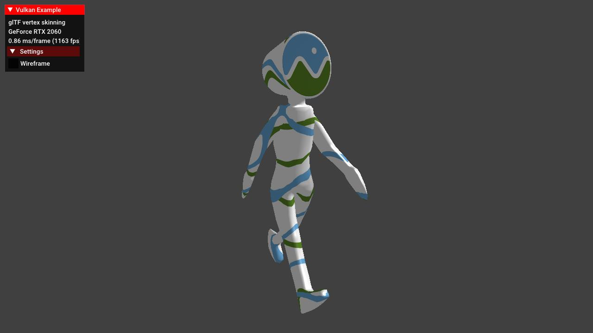

# glTF vertex skinning



## Synopsis

Renders an animated glTF model with vertex skinning. The sample is based on the [glTF scene](../gltfscene) sample, and adds data structures, functions and shaders required to apply vertex skinning to a mesh.

## Description

This example demonstrates how to load and use the data structures required for animating a mesh with vertex skinning.

Vertex skinning is a technique that uses per-vertex weights based on the current pose of a skeleton made up of bones.

Animations then are applied to those bones instead and during rendering the matrices of those bones along with the vertex weights are used to calculate the final vertex positions.

A good glTF skinning tutorial can be found [here](https://github.com/KhronosGroup/glTF-Tutorials/blob/master/gltfTutorial/gltfTutorial_020_Skins.md), so this readme only gives a coarse overview on the actual implementation instead of going into full detail on how vertex skinning works.

Note that this is not a full glTF implementation as this would be beyond the scope of a simple example. For a complete glTF Vulkan implementation see https://github.com/SaschaWillems/Vulkan-glTF-PBR/.

## Points of interest

**Note:** Points of interest are marked with a **POI** in the code comments:

```cpp
// POI: Get buffer data required for vertex skinning
```

### Data structures

Several new data structures are required for doing animations with vertex skinning. The [official glTF spec](https://github.com/KhronosGroup/glTF/tree/master/specification/2.0#skinned-mesh-attributes) has the details on those.

#### Node additions

```cpp
struct Node
{
  Node *              parent;
  uint32_t            index;
  std::vector<Node *> children;
  Mesh                mesh;
  glm::vec3           translation{};
  glm::vec3           scale{1.0f};
  glm::quat           rotation{};
  int32_t             skin = -1;
  glm::mat4           matrix;
  glm::mat4           getLocalMatrix();
};
```

The node now also stores the matrix components (```translation```, ```rotation``` ,```scale```) as they can be independently influenced.

The ```skin``` member is the index of the skin (see below) that is applied to this node.

A new function called ```getLocalMatrix``` is introduced that calculates the local matrix from the initial one and the current components.

#### Vertex additions

```cpp
	struct Vertex
	{
    ...
		glm::vec4 jointIndices;
		glm::vec4 jointWeights;
	};
```

To calculate the final matrix to be applied to the vertex we now pass the indices of the joints (see below) and the weights of those, which determines how strongly this vertex is influenced by the joint. glTF support at max. four indices and weights per joint, so we pass them as four-component vectors.

#### Skin

[glTF spec chapter on skins](https://github.com/KhronosGroup/glTF/tree/master/specification/2.0#skins)

```cpp
struct Skin
{
  std::string            name;
  Node *                 skeletonRoot = nullptr;
  std::vector<glm::mat4> inverseBindMatrices;
  std::vector<Node *>    joints;
  vks::Buffer            ssbo;
  VkDescriptorSet        descriptorSet;
};
```

This struct stores all information required for applying a skin to a mesh. Most important are the ```inverseBindMatrices``` used to transform the geometry into the space of the accompanying joint node. The ```joints``` vector contains the nodes used as joints in this skin.

We will pass the actual joint matrices for the current animation frame using a shader storage buffer object, so each skin also get's it's own ```ssboo``` along with a descriptor set to be bound at render time.

#### Animations

[glTF spec chapter on animations](https://github.com/KhronosGroup/glTF/tree/master/specification/2.0#animations)

##### Animation sampler
```cpp
struct AnimationSampler
{
  std::string            interpolation;
  std::vector<float>     inputs;
  std::vector<glm::vec4> outputsVec4;
};
```

The animation sampler contains the key frame data read from a buffer using an accessor and the way the key frame is interpolated. This can be ```LINEAR```, which is just a simple linear interpolation over time, ```STEP```, which remains constant until the next key frame is reached, and ```CUBICSPLINE``` which uses a cubic spline with tangents for calculating the interpolated key frames. This is a bit more complex and separately documented in this [glTF spec chapter](https://github.com/KhronosGroup/glTF/tree/master/specification/2.0#appendix-c-spline-interpolation).

**Note:** For simplicity, this sample only implements ```LINEAR``` interpolation.

##### Animation channel

```cpp
struct AnimationChannel
{
  std::string path;
  Node *      node;
  uint32_t    samplerIndex;
};
```

The animation channel connects the node with a key frame specified by an animation sampler with the ```path``` member specifying the node property to animate, which is either ```translation```, ```rotation```, ```scale``` or ```weights```. The latter one refers to morph targets and not vertex weights (for skinning) and is not used in this sample.

##### Animation
```cpp
struct Animation
{
  std::string                   name;
  std::vector<AnimationSampler> samplers;
  std::vector<AnimationChannel> channels;
  float                         start       = std::numeric_limits<float>::max();
  float                         end         = std::numeric_limits<float>::min();
  float                         currentTime = 0.0f;
};
```

The animation itself then contains the animation samplers and channels along with timing information.

#### Loading and passing the data

##### Vertex attributes

This samples adds two new vertex attributes for passing per-vertex `joints` and `weights` information. As with other per-vertex attributes, these need to be loaded using glTF accessors in `VulkanglTFModel::loadNode`:

```cpp
// Get vertex joint indices
if (glTFPrimitive.attributes.find("JOINTS_0") != glTFPrimitive.attributes.end())
{
  const tinygltf::Accessor &  accessor = input.accessors[glTFPrimitive.attributes.find("JOINTS_0")->second];
  const tinygltf::BufferView &view     = input.bufferViews[accessor.bufferView];
  jointIndicesBuffer                   = reinterpret_cast<const uint16_t *>(&(input.buffers[view.buffer].data[accessor.byteOffset + view.byteOffset]));
}
// Get vertex joint weights
if (glTFPrimitive.attributes.find("WEIGHTS_0") != glTFPrimitive.attributes.end())
{
  const tinygltf::Accessor &  accessor = input.accessors[glTFPrimitive.attributes.find("WEIGHTS_0")->second];
  const tinygltf::BufferView &view     = input.bufferViews[accessor.bufferView];
  jointWeightsBuffer                   = reinterpret_cast<const float *>(&(input.buffers[view.buffer].data[accessor.byteOffset + view.byteOffset]));
}
```

As usual we check if those attributes actually exist inside the glTF file, and if so we use the accessor and buffer view to get a pointer to the required vertex attributes.

The new attributes are added to the vertex input state of our pipeline in `VulkanExample::preparePipelines` at locations 4 and 5:

```cpp
const std::vector<VkVertexInputAttributeDescription> vertexInputAttributes = {
    ...
    {4, 0, VK_FORMAT_R32G32B32A32_SFLOAT, offsetof(VulkanglTFModel::Vertex, jointIndices)},
    {5, 0, VK_FORMAT_R32G32B32A32_SFLOAT, offsetof(VulkanglTFModel::Vertex, jointWeights)},
};
```

Vertex shader interface in `skinnedmodel.vert`:

```glsl
layout (location = 4) in vec4 inJointIndices;
layout (location = 5) in vec4 inJointWeights;
```

##### Skins

Loading skins is done in `VulkanglTFModel::loadSkin` and aside from getting the required data from the glTF sources into our own structures, this method also creates a buffer for uploading the inverse bind matrices:

```cpp
void VulkanglTFModel::loadSkins(tinygltf::Model &input)
{
	skins.resize(input.skins.size());

	for (size_t i = 0; i < input.skins.size(); i++)
	{
		tinygltf::Skin glTFSkin = input.skins[i];
		...
		if (glTFSkin.inverseBindMatrices > -1)
		{
			const tinygltf::Accessor &  accessor   = input.accessors[glTFSkin.inverseBindMatrices];
			const tinygltf::BufferView &bufferView = input.bufferViews[accessor.bufferView];
			const tinygltf::Buffer &    buffer     = input.buffers[bufferView.buffer];
			skins[i].inverseBindMatrices.resize(accessor.count);
			memcpy(skins[i].inverseBindMatrices.data(), &buffer.data[accessor.byteOffset + bufferView.byteOffset], accessor.count * sizeof(glm::mat4));

			vulkanDevice->createBuffer(
			    VK_BUFFER_USAGE_STORAGE_BUFFER_BIT,
			    VK_MEMORY_PROPERTY_HOST_VISIBLE_BIT | VK_MEMORY_PROPERTY_HOST_COHERENT_BIT,
			    &skins[i].ssbo,
			    sizeof(glm::mat4) * skins[i].inverseBindMatrices.size(),
			    skins[i].inverseBindMatrices.data());
			...
		}
	}
```

Vertex shader interface in `skinnedmodel.vert`:

```glsl
layout(std430, set = 1, binding = 0) readonly buffer JointMatrices {
	mat4 jointMatrices[];
};
```

As with e.g. vertex attributes we retrieve the inverse bind matrices from the glTF accessor and buffer view. These are used at a later point for generating the actual animation matrices.

We then create a shader storage buffer object (for each skin) big enough to hold all animation matrices. See [Updating the animations](#UpdatingAnimation) for how these are calculated and updated.

**Note**: For simplicity we create a host visible SSBO. This makes code easier to read. In a real-world application you'd use a device local SSBO instead.

##### Animations

Loading the animation data is done in ```VulkanglTFModel::loadAnimations``` and is also mostly about getting the required data from glTF into our own sources, including sampler and channel data.

The most interesting part is getting the input and output pairs for the animation's samplers, which are loaded using glTF's accessors.

We first load the **sampler's input values**, containing keyframe time values. These are also used to determine the start and end time of the animation:

```cpp
void VulkanglTFModel::loadAnimations(tinygltf::Model &input)
	...
	for (size_t i = 0; i < input.animations.size(); i++)
	{
		...
		for (size_t j = 0; j < glTFAnimation.samplers.size(); j++)
		{
			...
			{
				const tinygltf::Accessor &  accessor   = input.accessors[glTFSampler.input];
				const tinygltf::BufferView &bufferView = input.bufferViews[accessor.bufferView];
				const tinygltf::Buffer &    buffer     = input.buffers[bufferView.buffer];
				const void *                dataPtr    = &buffer.data[accessor.byteOffset + bufferView.byteOffset];
				const float *               buf        = static_cast<const float *>(dataPtr);
				for (size_t index = 0; index < accessor.count; index++)
				{
					dstSampler.inputs.push_back(buf[index]);
				}
				// Adjust animation's start and end times 
				for (auto input : animations[i].samplers[j].inputs)
				{
					if (input < animations[i].start)
					{
						animations[i].start = input;
					};
					if (input > animations[i].end)
					{
						animations[i].end = input;
					}
				}
			}
```

Next up are the **sampler's output values** containing the keyframe output values for the input time values read above:

```cpp
void VulkanglTFModel::loadAnimations(tinygltf::Model &input)
	...
	for (size_t i = 0; i < input.animations.size(); i++)
	{
		...
		for (size_t j = 0; j < glTFAnimation.samplers.size(); j++)
		{
			...
			// Read sampler keyframe output translate/rotate/scale values
			{
				const tinygltf::Accessor &  accessor   = input.accessors[glTFSampler.output];
				const tinygltf::BufferView &bufferView = input.bufferViews[accessor.bufferView];
				const tinygltf::Buffer &    buffer     = input.buffers[bufferView.buffer];
				const void *                dataPtr    = &buffer.data[accessor.byteOffset + bufferView.byteOffset];
				switch (accessor.type)
				{
					case TINYGLTF_TYPE_VEC3: {
						const glm::vec3 *buf = static_cast<const glm::vec3 *>(dataPtr);
						for (size_t index = 0; index < accessor.count; index++)
						{
							dstSampler.outputsVec4.push_back(glm::vec4(buf[index], 0.0f));
						}
						break;
					}
					case TINYGLTF_TYPE_VEC4: {
						const glm::vec4 *buf = static_cast<const glm::vec4 *>(dataPtr);
						for (size_t index = 0; index < accessor.count; index++)
						{
							dstSampler.outputsVec4.push_back(buf[index]);
						}
						break;
					}
					default: {
						std::cout << "unknown type" << std::endl;
						break;
					}
				}
			}
```

As the comment notes these outputs apply to a certain animation target path, which is either a translation, rotation or scale.

The path and node that the output keyframe values are applied to are part of the animation's channel:

```cpp
	...
	for (size_t i = 0; i < input.animations.size(); i++)
	{
		...
		for (size_t j = 0; j < glTFAnimation.channels.size(); j++)
		{
			tinygltf::AnimationChannel glTFChannel = glTFAnimation.channels[j];
			AnimationChannel &         dstChannel  = animations[i].channels[j];
			dstChannel.path                        = glTFChannel.target_path;
			dstChannel.samplerIndex                = glTFChannel.sampler;
			dstChannel.node                        = nodeFromIndex(glTFChannel.target_node);
		}
```

So if the animation's channel's path is set to ```translation```, the keyframe output values contain translation values that are applied to the channel's node depending on the current animation time.


#### <a name="UpdatingAnimation"></a>Updating the animation

With all required structures loaded, the next step is updating the actual animation data. This is done inside the ```VulkanglTFModel::updateAnimation``` function, where the data from the animation's samplers and channels is applied to the animation targets of the destination node.

We first update the active animation's current timestamp and also check if we need to restart it:

```cpp
Animation &animation = animations[activeAnimation];
animation.currentTime += deltaTime;
if (animation.currentTime > animation.end)
{
  animation.currentTime -= animation.end;
}
```

Next we go through all the channels that are applied to this animation (translation, rotation, scale) and try to find the input keyframe values for the current timestamp:

```cpp
for (auto &channel : animation.channels)
{
  AnimationSampler &sampler = animation.samplers[channel.samplerIndex];
  for (size_t i = 0; i < sampler.inputs.size() - 1; i++)
  {
    // Get the input keyframe values for the current time stamp
    if ((animation.currentTime >= sampler.inputs[i]) && (animation.currentTime <= sampler.inputs[i + 1]))
    {
      // Calculate interpolation value based on timestamp, Update node, see next paragraph
    }
  }
}
```

Inside the above loop we then calculate the interpolation value based on the animation's current time and the sampler's input keyframes for the current and next frame:

```cpp
float a = (animation.currentTime - sampler.inputs[i]) / (sampler.inputs[i + 1] - sampler.inputs[i]);
```

This interpolation value is then used to apply the keyframe output values to the appropriate channel:

```cpp
if (channel.path == "translation")
{
  channel.node->translation = glm::mix(sampler.outputsVec4[i], sampler.outputsVec4[i + 1], a);
}
if (channel.path == "rotation")
{
  glm::quat q1;
  q1.x = sampler.outputsVec4[i].x;
  q1.y = sampler.outputsVec4[i].y;
  q1.z = sampler.outputsVec4[i].z;
  q1.w = sampler.outputsVec4[i].w;

  glm::quat q2;
  q2.x = sampler.outputsVec4[i + 1].x;
  q2.y = sampler.outputsVec4[i + 1].y;
  q2.z = sampler.outputsVec4[i + 1].z;
  q2.w = sampler.outputsVec4[i + 1].w;

  channel.node->rotation = glm::normalize(glm::slerp(q1, q2, a));
}
if (channel.path == "scale")
{
  channel.node->scale = glm::mix(sampler.outputsVec4[i], sampler.outputsVec4[i + 1], a);
}
```

**Note:** As mentioned earlier, this sample only supports linear interpolation types.

Translation and scale is a simple linear interpolation between the output keyframe values of the current and next frame.

Rotations use quaternions and as such are interpolated using spherical linear interpolation.

After the node's animation components have been updated, we update all node joints:

```cpp
for (auto &node : nodes)
{
  updateJoints(node);
}
```

The ```updateJoints``` function will calculate the actual joint matrices and update the shader storage buffer object:

```cpp
void VulkanglTFModel::updateJoints(VulkanglTFModel::Node *node)
{
	if (node->skin > -1)
	{
		// Update the joint matrices
		glm::mat4              inverseTransform = glm::inverse(getNodeMatrix(node));
		Skin                   skin             = skins[node->skin];
		size_t                 numJoints        = (uint32_t) skin.joints.size();
		std::vector<glm::mat4> jointMatrices(numJoints);
		for (size_t i = 0; i < numJoints; i++)
		{
			jointMatrices[i] = getNodeMatrix(skin.joints[i]) * skin.inverseBindMatrices[i];
			jointMatrices[i] = inverseTransform * jointMatrices[i];
		}
		// Update ssbo
		skin.ssbo.copyTo(jointMatrices.data(), jointMatrices.size() * sizeof(glm::mat4));
	}

	for (auto &child : node->children)
	{
		updateJoints(child);
	}
}
```

Note the use of the ```getNodeMatrix``` function which will return the current matrix of a given node calculated from the node hierarchy and the node's current translate/rotate/scale values updated earlier. This is the actual matrix that's updated by the current animation state.

After this we copy the new joint matrices to the shader storage buffer object of the current skin to make it available to the shader.

#### Rendering the model

With all the matrices calculated and made available to the shaders, we can now finally render our animated model using vertex skinning.

Rendering the glTF model is done in ```VulkanglTFModel::draw``` which is called at command buffer creation. Since glTF has a hierarchical node structure this function recursively calls ```VulkanglTFModel::drawNode``` for rendering a give node with it's children:

```cpp
void VulkanglTFModel::drawNode(VkCommandBuffer commandBuffer, VkPipelineLayout pipelineLayout, VulkanglTFModel::Node node)
{
	if (node.mesh.primitives.size() > 0)
	{
		// Pass the node's matrix via push constants
		// Traverse the node hierarchy to the top-most parent to get the final matrix of the current node
		glm::mat4              nodeMatrix    = node.matrix;
		VulkanglTFModel::Node *currentParent = node.parent;
		while (currentParent)
		{
			nodeMatrix    = currentParent->matrix * nodeMatrix;
			currentParent = currentParent->parent;
		}
		// Pass the final matrix to the vertex shader using push constants
		vkCmdPushConstants(commandBuffer, pipelineLayout, VK_SHADER_STAGE_VERTEX_BIT, 0, sizeof(glm::mat4), &nodeMatrix);
		// Bind SSBO with skin data for this node to set 1
		vkCmdBindDescriptorSets(commandBuffer, VK_PIPELINE_BIND_POINT_GRAPHICS, pipelineLayout, 1, 1, &skins[node.skin].descriptorSet, 0, nullptr);
		for (VulkanglTFModel::Primitive &primitive : node.mesh.primitives)
		{
			if (primitive.indexCount > 0)
			{
				...
				vkCmdDrawIndexed(commandBuffer, primitive.indexCount, 1, primitive.firstIndex, 0, 0);
			}
		}
	}
	for (auto &child : node.children)
	{
		drawNode(commandBuffer, pipelineLayout, *child);
	}
}
```

There are two points-of-interest in this code related to vertex skinning.

First is passing the (fixed) model matrix via a push constant, which is not directly related to the animation itself but required later on on the shader:

```cpp
glm::mat4              nodeMatrix    = node.matrix;
VulkanglTFModel::Node *currentParent = node.parent;
while (currentParent)
{
  nodeMatrix    = currentParent->matrix * nodeMatrix;
  currentParent = currentParent->parent;
}
// Pass the final matrix to the vertex shader using push constants
vkCmdPushConstants(commandBuffer, pipelineLayout, VK_SHADER_STAGE_VERTEX_BIT, 0, sizeof(glm::mat4), &nodeMatrix);
```

As this matrix won't change in our case, we pass this is a push constant to the vertex shader.

And we also bind the shader storage buffer object of the skin so the vertex shader get's access to the current joint matrices for the skin to be applied to that particular node:

```cpp
vkCmdBindDescriptorSets(commandBuffer, VK_PIPELINE_BIND_POINT_GRAPHICS, pipelineLayout, 1, 1, &skins[node.skin].descriptorSet, 0, nullptr);
```

With the application side setup done, we can now take a look at the vertex shader that does the actual vertex skinning (```skinnedmodel.vert```).

As mentioned earlier, the interface has been expanded with values and attributes related to vertex skinning:

```glsl
#version 450

...
layout (location = 4) in vec4 inJointIndices;
layout (location = 5) in vec4 inJointWeights;

...

layout(push_constant) uniform PushConsts {
	mat4 model;
} primitive;

layout(std430, set = 1, binding = 0) readonly buffer JointMatrices {
	mat4 jointMatrices[];
};
```

Those are then used to calculate the skin matrix that's applied to the vertex position:

```glsl
void main() 
{
	...

	mat4 skinMat = 
		inJointWeights.x * jointMatrices[int(inJointIndices.x)] +
		inJointWeights.y * jointMatrices[int(inJointIndices.y)] +
		inJointWeights.z * jointMatrices[int(inJointIndices.z)] +
		inJointWeights.w * jointMatrices[int(inJointIndices.w)];

	gl_Position = uboScene.projection * uboScene.view * primitive.model * skinMat * vec4(inPos.xyz, 1.0);

	...
}
```

The skin matrix is a linear combination of the joint matrices. The indices of the joint matrices to be applied are taken from the ```inJointIndices``` vertex attribute, with each component (xyzw) storing one index, and those matrices are then weighted by the ```inJointWeights``` vertex attribute to calculate the final skin matrix that is applied to this vertex.