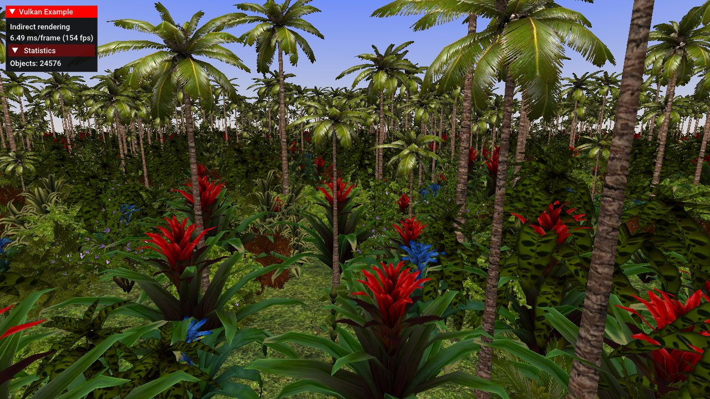

# Indirect drawing



## Synopsis

Issue multiple instanced draws for different meshes in one single draw call using indirect draw commands.

## Requirements
If the [`multiDrawIndirect`](http://vulkan.gpuinfo.org/listreports.php?feature=multiDrawIndirect) feature is supported, only one draw call is issued for the plants. If this feature is not available multiple indirect draw commands are used. ***Note:*** When issuing many draw counts also make sure to stay within the limitations of [`maxDrawIndirectCount`](http://vulkan.gpuinfo.org/listreports.php?limit=maxDrawIndirectCount).

## Description

This example demonstrates the use of indirect draw commands. In addition to draw functions like [`vkCmdDraw`](https://www.khronos.org/registry/vulkan/specs/1.0/man/html/vkCmdDraw.html) and [`vkCmdDrawIndexed`](https://www.khronos.org/registry/vulkan/specs/1.0/man/html/vkCmdDrawIndexed.html), where the parameters that specify what is drawn are passed directly to the function ("direct drawing"), there also exist indirect drawing commands.

[`vkCmdDrawIndirect`](https://www.khronos.org/registry/vulkan/specs/1.0/man/html/vkCmdDrawIndirect.html) and [`vkCmdDrawIndexedIndirect`](https://www.khronos.org/registry/vulkan/specs/1.0/man/html/vkCmdDrawIndexedIndirect.html) take the draw commands from a buffer object that contains descriptions on the draw commands to be issued, including instance and index counts, vertex offsets, etc. This also allows to draw multiple geometries with a single draw command as long as they're backed up by the same vertex (and index) buffer.

This adds several new possibilities of generating (and updating) actual draw commands, as that buffer can be generated and updated offline with no need to actually update the command buffers that contain the actual drawing functions.

Using indirect drawing you can generate the draw commands offline ahead of time on the CPU and even update them using shaders (as they're stored in a device local buffer). This adds lots of new possibilities to update draw commands without the CPU being involved, including GPU-based culling.

The example generates a single indirect buffer that contains draw commands for 12 different plants at random position, scale and rotation also using instancing to render the objects multiple times. The whole foliage (and trees) seen in the screen are drawn using only one draw call.

The different plant meshes are loaded from a single file and stored inside a single index and vertex buffer, index offsets are stored inside the indirect draw commands.

For details on the use of instancing (and instanced vertex attributes), see the [instancing example](../instancing)

## Points of interest

### Preparing the indirect draw
The example generates the indirect drawing buffer right at the start. First step is to generate the data for the indirect draws. Vulkan has a dedicated struct for this called `VkDrawIndexedIndirectCommand` and the example uses a `std::vector<VkDrawIndexedIndirectCommand>` to store these before uploading them to the GPU:
```cpp
void prepareIndirectData()
{
  ...
  uint32_t m = 0;
  for (auto& meshDescriptor : meshes.plants.meshDescriptors)
  {
    VkDrawIndexedIndirectCommand indirectCmd{};
    indirectCmd.instanceCount = OBJECT_INSTANCE_COUNT;
    indirectCmd.firstInstance = m * OBJECT_INSTANCE_COUNT;
    indirectCmd.firstIndex = meshDescriptor.indexBase;
    indirectCmd.indexCount = meshDescriptor.indexCount;
    indirectCommands.push_back(indirectCmd);
    m++;
  }
  ...
}
```
The meshDescriptor is generated by the mesh loader and contains the index base and count of that mesh inside the global index buffer containing all plant meshes for the scenery.

The indirect draw command for the second plant mesh looks like this:
```cpp
indirectCmd.indexCount = 1668;
indirectCmd.instanceCount = 2048;
indirectCmd.firstIndex = 960;
indirectCmd.vertexOffset = 0;
indirectCmd.firstInstance = 2048;
```
Which will result in 2048 instances of the index data starting at index 960 (using 1668 indices) being drawn, the first instance is also important as the shader is using it for the instanced attributes of that object (position, rotation, scale).

Once we have filled that vector we need to create the buffer that the GPU uses to read the indirect commands from:

```cpp
VK_CHECK_RESULT(vulkanDevice->createBuffer(
  VK_BUFFER_USAGE_INDIRECT_BUFFER_BIT | VK_BUFFER_USAGE_TRANSFER_DST_BIT,
  VK_MEMORY_PROPERTY_DEVICE_LOCAL_BIT,
  &indirectCommandsBuffer,
  stagingBuffer.size));

vulkanDevice->copyBuffer(&stagingBuffer, &indirectCommandsBuffer, queue);
```
To use a buffer for indirect draw commands you need to specify the ```VK_BUFFER_USAGE_INDIRECT_BUFFER_BIT``` usage flag at creation time. As the buffer is never again changed on the host side we stage it to the GPU to maximize performance.

### Rendering
If the [`multiDrawIndirect`](http://vulkan.gpuinfo.org/listreports.php?feature=multiDrawIndirect) is supported, we can issue all indirect draws with one single draw call:
```cpp
void buildCommandBuffers()
{
  ...
  for (int32_t i = 0; i < drawCmdBuffers.size(); ++i)
  {
    vkCmdDrawIndexedIndirect(drawCmdBuffers[i], indirectCommandsBuffer.buffer, 0, indirectDrawCount, sizeof(VkDrawIndexedIndirectCommand));
  }
}
```
We just pass the buffer handle to the buffer containing the indirect draw commands and the number of drawCounts.

The non-indirect, non-instanced equivalent of this would be:
```cpp
for (auto indirectCmd : indirectCommands)
  {
    for (uint32_t j = 0; j < indirectCmd.instanceCount; j++)
    {
      vkCmdDrawIndexed(drawCmdBuffers[i], indirectCmd.indexCount, 1, indirectCmd.firstIndex, 0, indirectCmd.firstInstance + j);
    }
  }
```

If the GPU does not support ```multiDrawIndirect``` we have to issue the indirect draw commands one-by-one using a buffer offset instead:
```cpp
for (auto j = 0; j < indirectCommands.size(); j++)
{
  vkCmdDrawIndexedIndirect(drawCmdBuffers[i], indirectCommandsBuffer.buffer, j * sizeof(VkDrawIndexedIndirectCommand), 1, sizeof(VkDrawIndexedIndirectCommand));
}
```

### Acknowledgments
- Plant and foliage models by [Hugues Muller](http://www.yughues-folio.com/)
