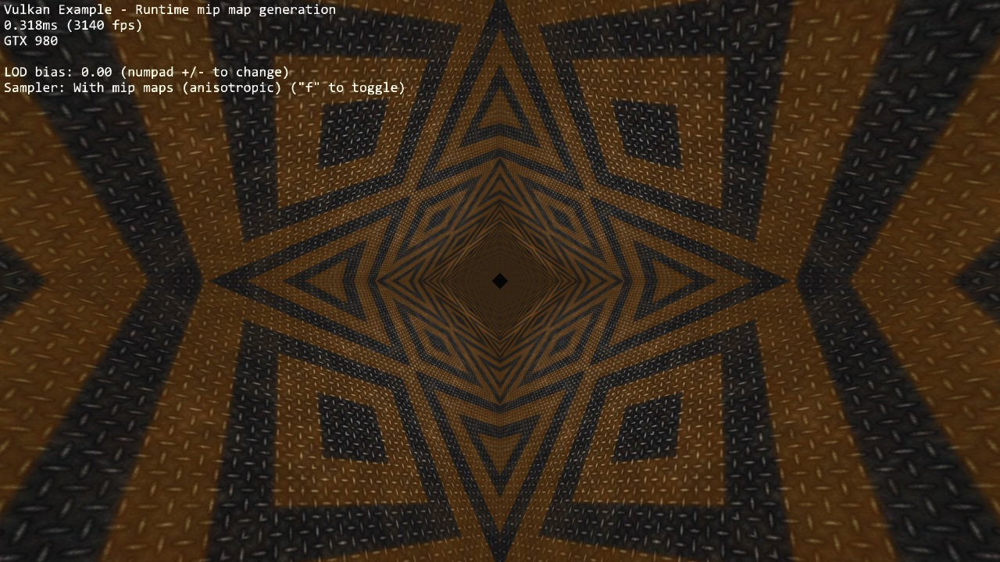

# Run-time mip-map generation



## Synopsis

Generates a complete texture mip-chain at runtime from a base image using image blits and proper image barriers.

## Requirements
To downsample from one mip level to the next, we will be using [```vkCmdBlitImage```](https://www.khronos.org/registry/vulkan/specs/1.0/man/html/vkCmdBlitImage.html). This requires the format used to support the ```BLIT_SRC_BIT``` and the  ```BLIT_DST_BIT``` flags. If these are not supported, the image format can't be used to blit and you'd either have to choose a different format or use e.g. a compute shader to generate mip levels. The example uses the ```VK_FORMAT_R8G8B8A8_UNORM``` that should support these flags on most implementations.

***Note:*** Use [```vkGetPhysicalDeviceFormatProperties```](https://www.khronos.org/registry/vulkan/specs/1.0/man/html/vkGetPhysicalDeviceFormatProperties.html) to check if the format supports the blit flags first. 

## Description

This examples demonstrates how to generate a complete texture mip-chain at runtime instead of loading offline generated mip-maps from a texture file.

While usually not applied for textures stored on the disk (that usually have the mips generated offline and stored in the file, see [basic texture mapping example](../texture)) this technique is used textures are generated at runtime, e.g. when doing dynamic cubemaps or other render-to-texture effects.

Having mip-maps for runtime generated textures offers lots of benefits, both in terms of image stability and performance. Without mip mapping the image will become noisy, especially with high frequency textures (and texture components like specular) and using mip mapping will result in higher performance due to caching.

Though this example only generates one mip-chain for a single texture at the beginning this technique can also be used during normal frame rendering to generate mip-chains for dynamic textures. 

Some GPUs also offer ```asynchronous transfer queues``` (check for queue families with only the ?  ```VK_QUEUE_TRANSFER_BIT``` set) that may be used to speed up such operations.  

## Points of interest

### Image setup
Even though we'll only upload the first mip level initially, we create the image with number of desired mip levels. The following formula is used to calculate the number of mip levels based on the max. image extent:

```cpp
texture.mipLevels = floor(log2(std::max(texture.width, texture.height))) + 1;
```

This is then passed to the image creat info:

```cpp
VkImageCreateInfo imageCreateInfo = vkTools::initializers::imageCreateInfo();
imageCreateInfo.imageType = VK_IMAGE_TYPE_2D;
imageCreateInfo.format = format;
imageCreateInfo.mipLevels = texture.mipLevels;
...
```

Setting the number of desired mip levels is necessary as this is used for allocating the right amount of memory for the image (```vkAllocateMemory```). 

### Upload base mip level

Before generating the mip-chain we need to copy the image data loaded from disk into the newly generated image. This image will be the base for our mip-chain:

```cpp
VkBufferImageCopy bufferCopyRegion = {};
bufferCopyRegion.imageSubresource.aspectMask = VK_IMAGE_ASPECT_COLOR_BIT;
bufferCopyRegion.imageSubresource.mipLevel = 0;
bufferCopyRegion.imageExtent.width = texture.width;
bufferCopyRegion.imageExtent.height = texture.height;
bufferCopyRegion.imageExtent.depth = 1;

vkCmdCopyBufferToImage(copyCmd, stagingBuffer, texture.image, VK_IMAGE_LAYOUT_TRANSFER_DST_OPTIMAL, 1, &bufferCopyRegion);
```

### Prepare base mip level
As we are going to blit ***from*** the base mip-level just uploaded we also need to set insert an image memory barrier that sets the image layout to ```TRANSFER_SRC``` for the base mip level:

```cpp
VkImageSubresourceRange subresourceRange = {};
subresourceRange.aspectMask = VK_IMAGE_ASPECT_COLOR_BIT;
subresourceRange.levelCount = 1;
subresourceRange.layerCount = 1;

vks::tools::insertImageMemoryBarrier(
  copyCmd,
  texture.image,
  VK_ACCESS_TRANSFER_WRITE_BIT,
  VK_ACCESS_TRANSFER_READ_BIT,
  VK_IMAGE_LAYOUT_TRANSFER_DST_OPTIMAL,
  VK_IMAGE_LAYOUT_TRANSFER_SRC_OPTIMAL,
  VK_PIPELINE_STAGE_TRANSFER_BIT,
  VK_PIPELINE_STAGE_TRANSFER_BIT,
  subresourceRange);
```

### Generating the mip-chain
There are two different ways of generating the mip-chain. The first one is to blit down the whole mip-chain from level n-1 to n, the other way would be to always use the base image and blit down from that to all levels. This example uses the first one.

***Note:*** Blitting (same for copying) images is done inside of a command buffer that has to be submitted and as such has to be synchronized before using the new image with e.g. a ```vkFence```. 

We simply loop over all remaining mip levels (level 0 was loaded from disk) and prepare a ```VkImageBlit``` structure for each blit from mip level i-1 to level i.

First the source for out blit. This is the previous mip level. The dimensions of the blit source are specified by srcOffset:
```cpp
for (int32_t i = 1; i < texture.mipLevels; i++)
{
  VkImageBlit imageBlit{};				

  // Source
  imageBlit.srcSubresource.aspectMask = VK_IMAGE_ASPECT_COLOR_BIT;
  imageBlit.srcSubresource.layerCount = 1;
  imageBlit.srcSubresource.mipLevel = i-1;
  imageBlit.srcOffsets[1].x = int32_t(texture.width >> (i - 1));
  imageBlit.srcOffsets[1].y = int32_t(texture.height >> (i - 1));
  imageBlit.srcOffsets[1].z = 1;
```
Setup for the destination mip level (1), with the dimensions for the blit destination specified in dstOffsets[1]:
```cpp
  // Destination
  imageBlit.dstSubresource.aspectMask = VK_IMAGE_ASPECT_COLOR_BIT;
  imageBlit.dstSubresource.layerCount = 1;
  imageBlit.dstSubresource.mipLevel = i;
  imageBlit.dstOffsets[1].x = int32_t(texture.width >> i);
  imageBlit.dstOffsets[1].y = int32_t(texture.height >> i);
  imageBlit.dstOffsets[1].z = 1;
```

Before we can blit to this mip level, we need to transition its image layout to ```TRANSFER_DST```:
```cpp
  VkImageSubresourceRange mipSubRange = {};
  mipSubRange.aspectMask = VK_IMAGE_ASPECT_COLOR_BIT;
  mipSubRange.baseMipLevel = i;
  mipSubRange.levelCount = 1;
  mipSubRange.layerCount = 1;

  // Prepare current mip level as image blit destination
  vks::tools::insertImageMemoryBarrier(
    blitCmd,
    texture.image,
    0,
    VK_ACCESS_TRANSFER_WRITE_BIT,
    VK_IMAGE_LAYOUT_UNDEFINED,
    VK_IMAGE_LAYOUT_TRANSFER_DST_OPTIMAL,
    VK_PIPELINE_STAGE_TRANSFER_BIT,
    VK_PIPELINE_STAGE_TRANSFER_BIT,
    mipSubRange);
``` 
Note that we set the ```baseMipLevel``` member of the subresource range so the image memory barrier will only affect the one mip level we want to copy to.

Now that the mip level we want to copy from and the one we'll copy to have are in the proper layout (transfer source and destination) we can issue the [```vkCmdBlitImage```](https://www.khronos.org/registry/vulkan/specs/1.0/man/html/vkCmdBlitImage.html) to copy from mip level (i-1) to mip level (i):

```cpp
  vkCmdBlitImage(
    blitCmd,
    texture.image,
    VK_IMAGE_LAYOUT_TRANSFER_SRC_OPTIMAL,
    texture.image,
    VK_IMAGE_LAYOUT_TRANSFER_DST_OPTIMAL,
    1,
    &imageBlit,
    VK_FILTER_LINEAR);
```
```vkCmdBlitImage``` does the (down) scaling from mip level (i-1) to mip level (i) using a linear filter.

After the blit is done we can use this mip level as a base for the next level, so we transition the layout from ```TRANSFER_DST_OPTIMAL``` to ```TRANSFER_SRC_OPTIMAL``` so we can use this level as transfer source for the next level:

```cpp
  // Prepare current mip level as image blit source for next level
  vks::tools::insertImageMemoryBarrier(
    copyCmd,
    texture.image,
    VK_ACCESS_TRANSFER_WRITE_BIT,
    VK_ACCESS_TRANSFER_READ_BIT,
    VK_IMAGE_LAYOUT_TRANSFER_DST_OPTIMAL,
    VK_IMAGE_LAYOUT_TRANSFER_SRC_OPTIMAL,
    VK_PIPELINE_STAGE_TRANSFER_BIT,
    VK_PIPELINE_STAGE_TRANSFER_BIT,
    mipSubRange);
}
```

### Final image layout transitions
Once the loop is done we need to transition all mip levels of the image to their actual usage layout, which is ```SHADER_READ``` for this example. Note that after the loop all levels will be in the ```TRANSER_SRC``` layout allowing us to transfer the whole image at once:

```cpp
  subresourceRange.levelCount = texture.mipLevels;
  vks::tools::insertImageMemoryBarrier(
    copyCmd,
    texture.image,
    VK_ACCESS_TRANSFER_READ_BIT,
    VK_ACCESS_SHADER_READ_BIT,
    VK_IMAGE_LAYOUT_TRANSFER_SRC_OPTIMAL,
    VK_IMAGE_LAYOUT_SHADER_READ_ONLY_OPTIMAL,
    VK_PIPELINE_STAGE_TRANSFER_BIT,
    VK_PIPELINE_STAGE_FRAGMENT_SHADER_BIT,
    subresourceRange);
```  

Submitting that command buffer will result in an image with a complete mip-chain and all mip levels being transitioned to the proper image layout for shader reads.

### Image View creation
The Image View also requires information about how many Mip Levels are used. This is specified in the ```VkImageViewCreateInfo.subresourceRange.levelCount``` field.

```cpp
  VkImageViewCreateInfo view = vks::initializers::imageViewCreateInfo();
  view.image = texture.image;
  view.viewType = VK_IMAGE_VIEW_TYPE_2D;
  view.format = format;
  view.components = { VK_COMPONENT_SWIZZLE_R, VK_COMPONENT_SWIZZLE_G, VK_COMPONENT_SWIZZLE_B, VK_COMPONENT_SWIZZLE_A };
  view.subresourceRange.aspectMask = VK_IMAGE_ASPECT_COLOR_BIT;
  view.subresourceRange.baseMipLevel = 0;
  view.subresourceRange.baseArrayLayer = 0;
  view.subresourceRange.layerCount = 1;
  view.subresourceRange.levelCount = texture.mipLevels;
```  