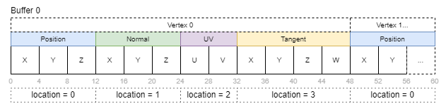
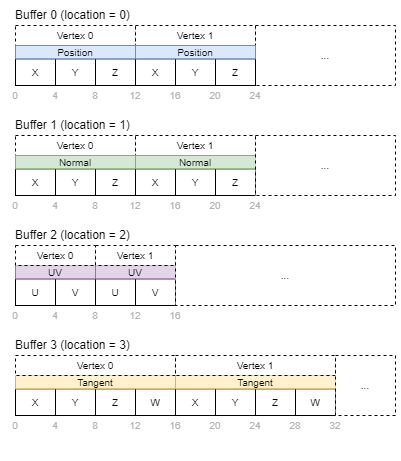

# Vertex attributes

## Synopsis

This sample demonstrates two different ways of providing vertex data to the GPU using either interleaved or separate buffers for vertex attributes.

## Shader interface

The shader interface for passing the vertex attributes is the same, no matter if the data provided is coming from a single interleaved or multiple separate buffers.

```glsl
layout (location = 0) in vec3 inPos;
layout (location = 1) in vec3 inNormal;
layout (location = 2) in vec2 inUV;
layout (location = 3) in vec4 inTangent;
```

## Interleaved vertex attributes

In an interleaved vertex buffer, the components that make up a single vertex are stored after each other, so the stride of a single vertex is the sum of it's component's sizes.



```cpp
// Binding
const std::vector<VkVertexInputBindingDescription> vertexInputBindingsInterleaved = {
    { 0, sizeof(Vertex), VK_VERTEX_INPUT_RATE_VERTEX },
};

// Attribute
const std::vector<VkVertexInputAttributeDescription> vertexInputAttributesInterleaved = {
    { 0, 0, VK_FORMAT_R32G32B32_SFLOAT, offsetof(Vertex, pos) },
    { 1, 0, VK_FORMAT_R32G32B32_SFLOAT, offsetof(Vertex, normal) },
    { 2, 0, VK_FORMAT_R32G32_SFLOAT, offsetof(Vertex, uv) },
    { 3, 0, VK_FORMAT_R32G32B32A32_SFLOAT, offsetof(Vertex, tangent) },
};
```

## Separate vertex attributes

When using separate buffers, each component is stored in it's own buffer. So e.g. the position buffer only contains vertex positions stored consecutively.



```cpp
// Bindings
const std::vector<VkVertexInputBindingDescription> vertexInputBindingsSeparate = {
    { 0, sizeof(glm::vec3), VK_VERTEX_INPUT_RATE_VERTEX },
    { 1, sizeof(glm::vec3), VK_VERTEX_INPUT_RATE_VERTEX },
    { 2, sizeof(glm::vec2), VK_VERTEX_INPUT_RATE_VERTEX },
    { 3, sizeof(glm::vec4), VK_VERTEX_INPUT_RATE_VERTEX },
};

// Attributes
const std::vector<VkVertexInputAttributeDescription> vertexInputAttributesSeparate = {
    { 0, 0, VK_FORMAT_R32G32B32_SFLOAT, 0 },
    { 1, 1, VK_FORMAT_R32G32B32_SFLOAT, 0 },
    { 2, 2, VK_FORMAT_R32G32_SFLOAT, 0 },
    { 3, 3, VK_FORMAT_R32G32B32A32_SFLOAT, 0 },
};
```