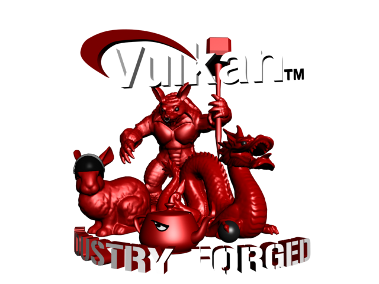
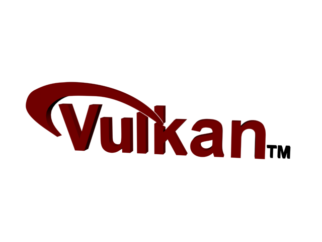
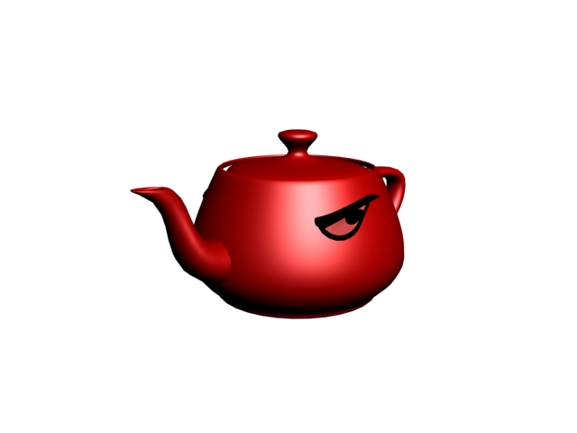
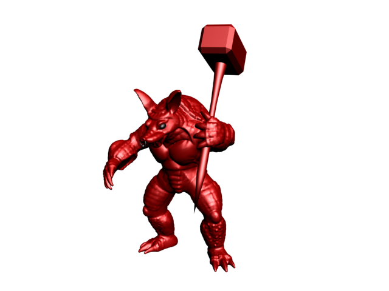
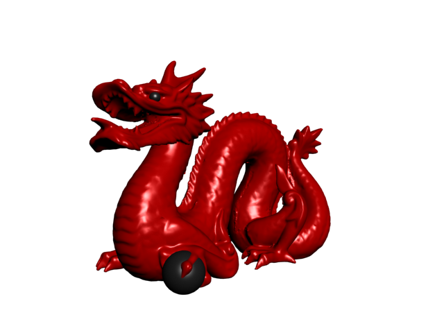
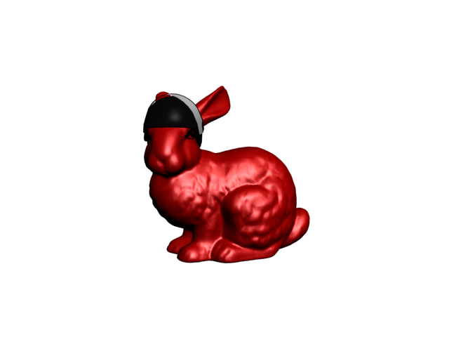

# Demo meshes

This directory contains the models used in the demos and examples.

Some of them are done by myself from scratch, others are based on existing models.

## License

Unless noted otherwise, the models are free to use under the terms of the [Creative Commons Attribution 3.0 license](http://creativecommons.org/licenses/by/3.0/).

The models from the Stanford 3D scanning repository don't come with a license, but I think it would be fair to also attribute them too when using the models I've based of their work.

If you use them in your (public) work, please drop me a line so I can check it out ;)

## Formats

Models are provided in different formats, but usually at least as .X (DirectX file format, binary version), as this format supports everything necessary to correctly display the models.

Some of the models are also available as [glTF](https://www.khronos.org/gltf) and [COLLADA](https://www.khronos.org/collada/) formats, both made by the Khronos group.

If you need the models in a different format (that's common) please drop me a line.

## Rendering

The demos and examples use [ASSIMP](http://assimp.sourceforge.net/) for loading the models, all models were tested for correct display using a sample C++ model renderer.

Note that the models are usually made up of several meshes due to different materials.

Also note that the scale of the models is not unified, so the general scale may differ. I usually do a normalization of model scaling upon loading models into my examples.

## Vulkan scene

A test scene with a high triangle count made up by all the single models listed here, see the model descriptions for details.

**As with the Vulkan Logo:** Please regard Khronos' [API logo usage and word mark guidelines](https://www.khronos.org/legal/trademarks/) when using this!

If you plan on using this for anything public I'd love know, sp please let me know!

## Vulkan Logo

A 3D rendition of the official Vulkan(tm) Logo. I made this based on the 2D logo, please note that it's not 100% perfect, e.g. the arc is slightly different.

**Important**: Please regard Khronos' [API logo usage and word mark guidelines](https://www.khronos.org/legal/trademarks/) when using this!

Triangle count : 4,348

## Angry teapot

Pretty much what it's name suggests. It's an angry teapot, based on the one from the (first) Vulkan T-Shirt Logo.

Made by me from scratch. Just some teapot with angry looking eyes.

*Note for rendering* : You may want to disable back-face culling on this to make it look proper when rendering.

Triangle count : 5,564

## Hamardillo

Based on the Stanford Armadillo : http://graphics.stanford.edu/data/3Dscanrep/

Since the mode is not rigged, I had to manually change arm and hand rotations and positions, so the seams are not perfect.
I also added some black eyes, a nose ring and a skull-crushing hammer to emphasize it's attitude over high driver overhead.

Triangle count : 91,956

## Chinese dragon

Based on the Stanford Dragon : http://graphics.stanford.edu/data/3Dscanrep/

(Please read their note on [inappropriate uses for this model](http://graphics.stanford.edu/data/3Dscanrep/#uses))

I did some optimizations on the model to lower the triangle count without loosing too mich detail and put some spheres in for the eyes and under the claw to make them pop out a bit more.

Triangle count : 102,880

## Tactical bunny

Based on the Stanford Bunny : http://graphics.stanford.edu/data/3Dscanrep/

Reduces vertex count, added some angry eyes (the one's from the angry teapot) and added a tactical helmet, so you get a bunny ready to take down some terrorists here.

The helmet is a slightly modified version of [this model](http://opengameart.org/content/helmet) by Flatlander, licensed under the [CC-BY 3.0](http://creativecommons.org/licenses/by/3.0/).

Triangle count : 42,210
