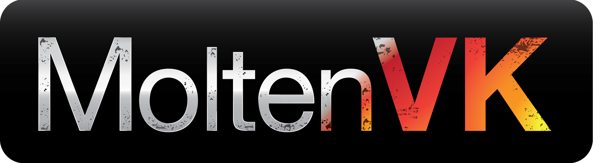

#MoltenVK Vulkan Examples

Copyright (c) 2016-2017 [The Brenwill Workshop Ltd.](http://www.brenwill.com).
This document is licensed under the MIT license (MIT) (http://opensource.org/licenses/MIT)

*This document is written in [Markdown](http://en.wikipedia.org/wiki/Markdown) format.
For best results, use a Markdown reader.*

Introduction
------------

The *Xcode* project in this folder builds and runs the *Vulkan* examples in this
repository on *iOS* and *macOS*, using the **MoltenVK** *Vulkan* driver.

Installing MoltenVK
-------------------

The examples in this repository can be run on *iOS* and *macOS* by using
the [**MoltenVK**](http://www.moltengl.com/moltenvk/) *Vulkan* driver.

These examples require **MoltenVK 0.18.0** or greater.

Follow these instructions to install **MoltenVK**:

1. [Download](https://moltengl.com/free-trial/) the **Molten** free evaluation trial.
   This free trial includes **MoltenVK**, is full-featured, and is not time-limited.
   You must purchase a license if you wish to use **MoltenVK** for a production
   application or game, but you can use the evaluation version to run these examples.

2. Unzip the **Molten** package, and move it to a folder outside this repository.

3. Open a *Terminal* session and navigate to the directory containing this document,
   remove the existing `MoltenVK` symbolic link in this directory, and create a new
   symbolic link pointing to the `MoltenVK` directory in the **Molten** package:

   		cd path-to-this-directory
		rm MoltenVK
		ln -s path-to-Molten-package/MoltenVK

Installing AssImp
-----------------

The examples in this repository make use of the [*AssImp*](http://assimp.sourceforge.net)
library to load resource assets from files. To run the examples you must download and
install *AssImp* library as follows.

>***Note:*** Due to the way that *AssImp* makes use of the *CMake* utility, an installation
of *AssImp* can only be built for a single platform. To create *AssImp* libraries for both
*iOS* and *macOS*, download a separate copy of the *AssImp* directory for each platform
(or create a copy of the downloaded *AssImp* directory for each platform before building).

####iOS

1. Download [AssImp 3.3.1](https://github.com/assimp/assimp/releases/tag/v3.3.1/).

2. Unzip and rename the directory to `assimp-3.3.1-ios`.

3. Open the file `assimp-3.3.1-ios/port/iOS/IPHONEOS_ARM64_TOOLCHAIN.cmake` file and comment
   out the following lines:

   		#SET (CC         "${DEVROOT}/usr/bin/llvm-gcc")
		#SET (CXX        "${DEVROOT}/usr/bin/llvm-g++")
		#CMAKE_FORCE_C_COMPILER          (${CC} LLVM)
		#CMAKE_FORCE_CXX_COMPILER        (${CXX} LLVM)

4. Open a *Terminal* session and navigate to the `assimp-3.3.1-ios/port/iOS` directory,
   and run the following build command:

		cd path-to-assimp-3.3.1-ios/port/iOS
		./build.sh --stdlib=libc++ --archs="arm64" --no-fat

5. In the `assimp` directory within this directory, remove the existing `assimp-ios`
   symbolic link, and create a new symbolic link pointing to the `assimp-3.3.1-ios` directory:

   		cd path-to-this-directory/assimp
		rm assimp-ios
		ln -s path-to-assimp-3.3.1-ios assimp-ios

####macOS

1. Download [AssImp 3.3.1](https://github.com/assimp/assimp/releases/tag/v3.3.1/).

2. Unzip and rename the directory to `assimp-3.3.1-macos`.

3. Open a *Terminal* session and navigate to the `assimp-3.3.1-macos` directory,
   and run the following build commands:

		cd path-to-assimp-3.3.1-macos
		cmake CMakeLists.txt -G 'Unix Makefiles'
		make

	* If compilation fails, fix typo in `assimp-3.3.1-macos/code/D3MFImporter.cpp` and try `make` again

4. In the `assimp` directory within this directory, remove the existing `assimp-macos`
   symbolic link, and create a new symbolic link pointing to the `assimp-3.3.1-macos` directory:

   		cd path-to-this-directory/assimp
		rm assimp-macos
		ln -s path-to-assimp-3.3.1-macos assimp-macos

Running the Vulkan Examples
---------------------------

The single `examples.xcodeproj` *Xcode* project can be used to run any of the examples
in this repository on either *iOS* or *macOS*. To do so, follow these instructions:

1. Open the `examples.xcodeproj` *Xcode* project.

2. Specify which of the many examples within this respository you wish to run, by opening
   the `examples.h` file within *Xcode*, and following the instructions in the comments
   within that file to indicate which of the examples you wish to run.

3. Run either the `examples-iOS` or `examples-macOS` *Xcode Scheme* to run the example in *iOS*
   or *macOS*, repectively.

4. Many of the examples include an option to press keys to control the display of features
   and scene components:

   - On *iOS*, tap on the scene to display the keyboard. Tap again on the scene to hide the keyboard.
   - On both *iOS* and *macOS*, use the numeric keys (*1, 2, 3...*) instead of function keys (*F1, F2, F3...*).
   - On both *iOS* and *macOS*, use the regular keyboard *+* and *-* keys instead of the numpad *+* and *-* keys.
   - On both *iOS* and *macOS*, use the *delete* key instead of the *escape* key.

